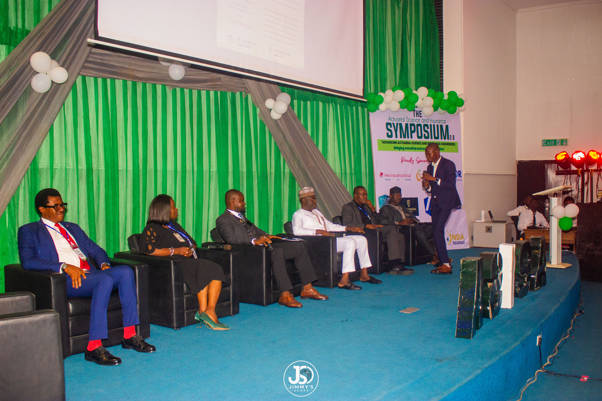
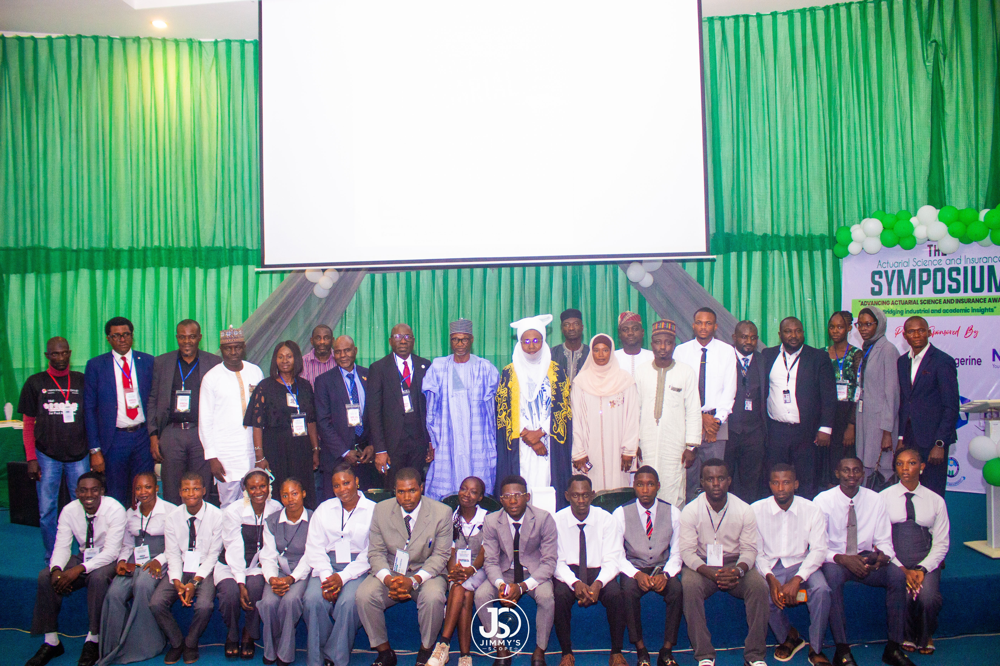
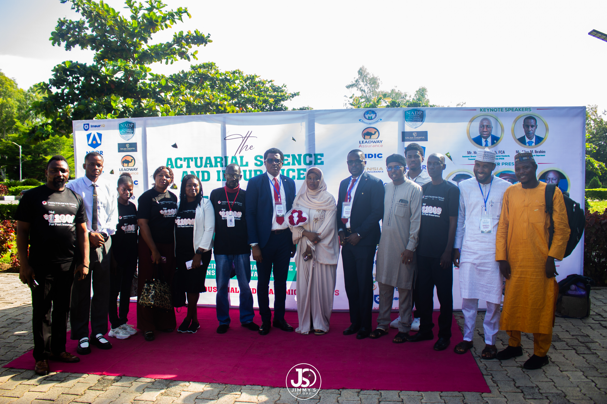
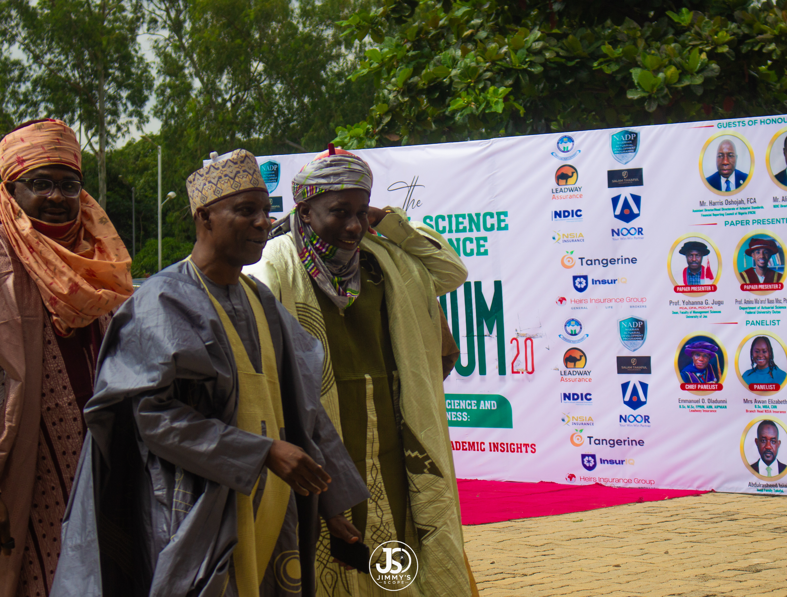
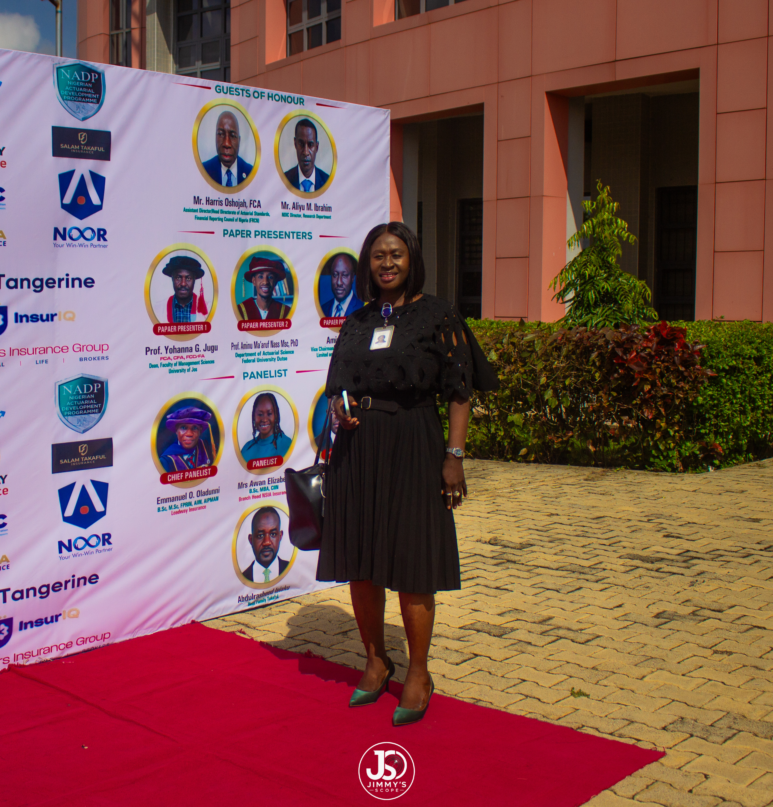
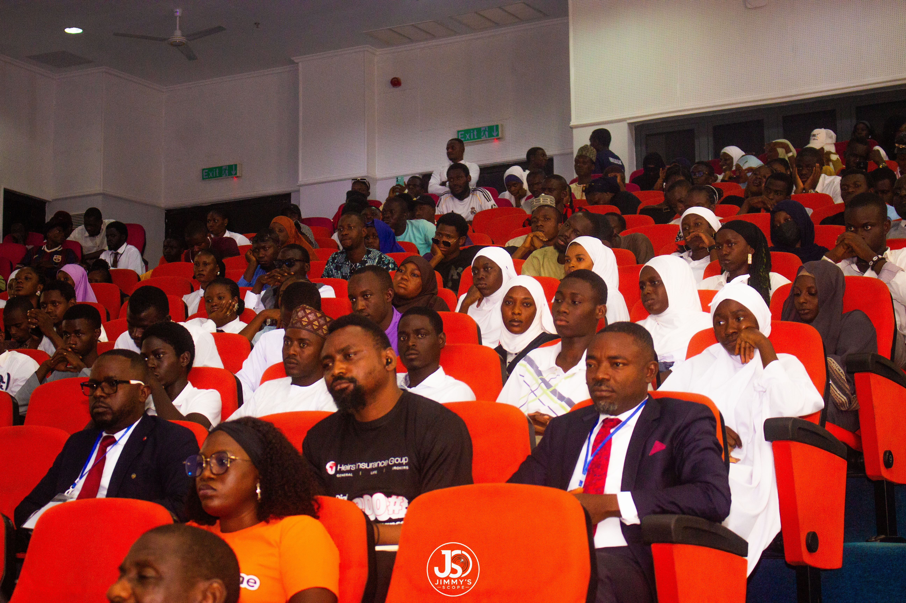
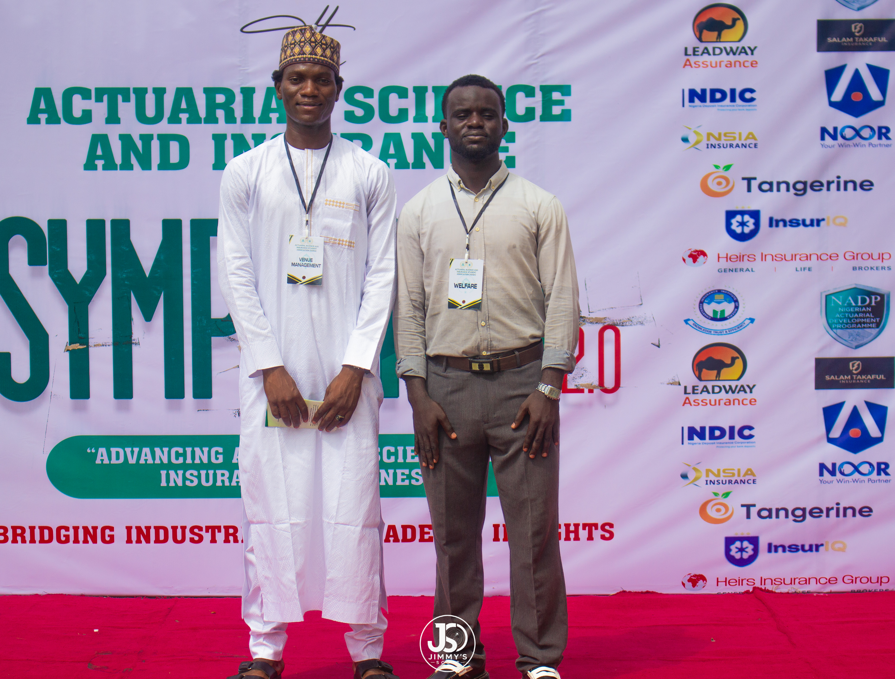

# CARDANO PRODUCT COMMITTEE (CPC), INTERSECT · RFP 05 · ASISA ABU

## Milestone 1: Project Inception and Research Design Report

### Cardano Market Entry into Nigeria Through Blockchain-Enabled Insurance

**Project:** Government and Emerging Markets Entry Strategy: Nigeria Insurance Vertical

**Prepared for:** The Cardano Product Committee (CPC), Intersect

**Principal Investigator:** Odufuwa O. Oluwakayode, President, ASISA ABU

**Organisation:** Actuarial Science and Insurance Students Association, Ahmadu Bello University (ASISA ABU), Zaria, Nigeria

**Version / date:** 1.0 · September 2026

**Classification:** Public (Contract Clause 4.1) · Licence CC BY 4.0

**Project reference:** CPC-26-0014 / ER-0004b-25 (RFP 05)

---

## Contents

- [Document Information](#document-information)
- [Acceptance Criteria Compliance Matrix](#acceptance-criteria-compliance-matrix)
- [Abstract](#abstract)
- [Glossary and Abbreviations](#glossary-and-abbreviations)
  - [Blockchain and Cardano terms](#blockchain-and-cardano-terms)
  - [Insurance terms](#insurance-terms)
  - [Institutions](#institutions)
  - [Legislation and programme terms](#legislation-and-programme-terms)
- [Chapter 1: Introduction and Contextual Background](#chapter-1-introduction-and-contextual-background)
  - [1.1 The Nigerian Insurance Market: Scale, Failure and Opportunity](#11-the-nigerian-insurance-market-scale-failure-and-opportunity)
  - [1.2 The 2025 to 2026 Policy and Regulatory Moment](#12-the-2025-to-2026-policy-and-regulatory-moment)
  - [1.3 The Blockchain Hypothesis](#13-the-blockchain-hypothesis)
  - [1.4 Statement of the Problem](#14-statement-of-the-problem)
  - [1.5 Research Objectives](#15-research-objectives)
  - [1.6 Significance of the Study](#16-significance-of-the-study)
  - [1.7 Scope and Delimitations](#17-scope-and-delimitations)
  - [1.8 Research Governance](#18-research-governance)
- [Chapter 2: Theoretical Framework, Research Questions and Hypotheses](#chapter-2-theoretical-framework-research-questions-and-hypotheses)
  - [2.1 Diffusion of Innovations (Rogers, 2003)](#21-diffusion-of-innovations-rogers-2003)
  - [2.2 Institutional Theory (DiMaggio & Powell, 1983; Scott, 2014)](#22-institutional-theory-dimaggio--powell-1983-scott-2014)
  - [2.3 Technology Acceptance Model (Davis, 1989; Venkatesh & Davis, 2000)](#23-technology-acceptance-model-davis-1989-venkatesh--davis-2000)
  - [2.4 Conceptual Framework](#24-conceptual-framework)
  - [2.5 Research Questions](#25-research-questions)
  - [2.6 Core Hypotheses](#26-core-hypotheses)
  - [2.7 The Eight Candidate Use-Case Hypotheses](#27-the-eight-candidate-use-case-hypotheses)
- [Chapter 3: Research Design and Methodology](#chapter-3-research-design-and-methodology)
  - [3.1 Epistemological Position](#31-epistemological-position)
  - [3.2 Research Approach](#32-research-approach)
  - [3.3 The Eight-Phase Research Architecture](#33-the-eight-phase-research-architecture)
  - [3.4 Gate A: The Pre-Fieldwork Provisional Screen](#34-gate-a-the-pre-fieldwork-provisional-screen)
  - [3.5 The Funnel in Summary](#35-the-funnel-in-summary)
  - [3.6 Data Collection Methods](#36-data-collection-methods)
  - [3.7 Data Analysis Framework](#37-data-analysis-framework)
  - [3.8 Validity and Trustworthiness](#38-validity-and-trustworthiness)
  - [3.9 Alignment of Instruments to Research Questions](#39-alignment-of-instruments-to-research-questions)
- [Chapter 4: Primary Research Plan and Stakeholder Strategy](#chapter-4-primary-research-plan-and-stakeholder-strategy)
  - [4.1 Target Population](#41-target-population)
  - [4.2 Sampling Strategy and Sample Composition](#42-sampling-strategy-and-sample-composition)
  - [4.3 The Stakeholder Access Roster](#43-the-stakeholder-access-roster)
  - [4.4 Access Status Definitions](#44-access-status-definitions)
  - [4.5 Interview Format and Logistics](#45-interview-format-and-logistics)
  - [4.6 Recruitment Sequencing](#46-recruitment-sequencing)
  - [4.7 The Symposium as Recruitment Infrastructure](#47-the-symposium-as-recruitment-infrastructure)
  - [4.8 Public Record of Ecosystem Outreach](#48-public-record-of-ecosystem-outreach)
- [Chapter 5: The Nine-Criterion Screening Model and Decision Gate Mapping](#chapter-5-the-nine-criterion-screening-model-and-decision-gate-mapping)
  - [5.1 Design Rationale](#51-design-rationale)
  - [5.2 The Nine Criteria](#52-the-nine-criteria)
  - [5.3 Scoring Methodology](#53-scoring-methodology)
  - [5.4 Decision Rules](#54-decision-rules)
  - [5.5 Scorecard Template](#55-scorecard-template)
  - [5.6 Decision Gate Mapping](#56-decision-gate-mapping)
- [Chapter 6: Quality Assurance and Bias Control Protocols](#chapter-6-quality-assurance-and-bias-control-protocols)
  - [6.1 Design Rationale](#61-design-rationale)
  - [6.2 The Ten Bias Control Protocols](#62-the-ten-bias-control-protocols)
  - [6.3 The Design Lock](#63-the-design-lock)
  - [6.4 Sponsor and Recognition Disclosure](#64-sponsor-and-recognition-disclosure)
- [Chapter 7: The Catalyst Event: The Actuarial and Insurance Symposium 2.0](#chapter-7-the-catalyst-event-the-actuarial-and-insurance-symposium-20)
  - [7.1 Overview](#71-overview)
  - [7.2 Connection to ASISA ABU's Institutional Mission](#72-connection-to-asisa-abus-institutional-mission)
  - [7.3 Programme and Participation](#73-programme-and-participation)
  - [7.4 Scale and Reach](#74-scale-and-reach)
  - [7.5 Epistemic Status of the Event](#75-epistemic-status-of-the-event)
  - [7.6 Evidence of Engagement by Counterparty](#76-evidence-of-engagement-by-counterparty)
  - [7.7 Photographic Record and Public Channels](#77-photographic-record-and-public-channels)
  - [7.8 Converting Symposium Contacts into Research Evidence](#78-converting-symposium-contacts-into-research-evidence)
  - [7.9 Structured Observation Protocol](#79-structured-observation-protocol)
  - [7.10 Limitations](#710-limitations)
- [Chapter 8: Research Ethics, Data Governance and Compliance](#chapter-8-research-ethics-data-governance-and-compliance)
  - [8.1 Ethical Principles](#81-ethical-principles)
  - [8.2 Data Classification and Handling](#82-data-classification-and-handling)
  - [8.3 Data Retention and Deletion](#83-data-retention-and-deletion)
  - [8.4 AI Disclosure (Contract Clause 4.2)](#84-ai-disclosure-contract-clause-42)
  - [8.5 Academic Oversight](#85-academic-oversight)
  - [8.6 Event Imagery](#86-event-imagery)
- [Chapter 9: Project Inception, Workspace, Cadence and Timeline](#chapter-9-project-inception-workspace-cadence-and-timeline)
  - [9.1 Project Kickoff](#91-project-kickoff)
  - [9.2 Progress and Timeline Note](#92-progress-and-timeline-note)
  - [9.3 Workspace and Tools](#93-workspace-and-tools)
  - [9.4 Project Timeline (24 Weeks)](#94-project-timeline-24-weeks)
  - [9.5 Milestone Trajectory](#95-milestone-trajectory)
  - [9.6 Deliverables Schedule](#96-deliverables-schedule)
  - [9.7 Public Reporting and Open-Source Commitment](#97-public-reporting-and-open-source-commitment)
- [Chapter 10: Inception Period Progress and Forward Look](#chapter-10-inception-period-progress-and-forward-look)
  - [10.1 Work Completed Since Kickoff](#101-work-completed-since-kickoff)
  - [10.2 Status by Workstream](#102-status-by-workstream)
  - [10.3 Progress Report: Narrative](#103-progress-report-narrative)
  - [10.4 Forward Look](#104-forward-look)
  - [10.5 Principal Risks and Mitigations](#105-principal-risks-and-mitigations)
- [References](#references)
- [Appendix A: Interview Protocols by Respondent Archetype](#appendix-a-interview-protocols-by-respondent-archetype)
  - [Module 1: Regulator Archetype (NAICOM, NDIC, FRCN)](#module-1-regulator-archetype-naicom-ndic-frcn)
  - [Module 2: Underwriter Archetype (Leadway, Heirs, NSIA, Tangerine, Nem)](#module-2-underwriter-archetype-leadway-heirs-nsia-tangerine-nem)
  - [Module 3: Insurtech and Takaful Archetype (InsureIQ, Salam Takaful, Noor Takaful)](#module-3-insurtech-and-takaful-archetype-insureiq-salam-takaful-noor-takaful)
  - [Module 4: Professional Body Archetype (CIIN, NAS, NADP)](#module-4-professional-body-archetype-ciin-nas-nadp)
  - [Module 5: Beneficiary-Side Archetype](#module-5-beneficiary-side-archetype)
- [Appendix B: Respondent Screener Criteria](#appendix-b-respondent-screener-criteria)
- [Appendix C: Regulatory Assessment Framework](#appendix-c-regulatory-assessment-framework)
- [Appendix D: Infrastructure Prerequisite Assessment Framework](#appendix-d-infrastructure-prerequisite-assessment-framework)
- [Appendix E: Figure Register and Image Credits](#appendix-e-figure-register-and-image-credits)

---

## Document Information

| Field | Detail |
|---|---|
| **Project title** | Government and Emerging Markets Entry Strategy: Nigeria Insurance Vertical |
| **Funding programme** | Cardano Product Committee (CPC), Intersect |
| **Project reference** | CPC - 26-0014 / ER-004b-25 (RFP 05) |
| **Deliverable** | Milestone 1: Inception and Research Design |
| **Prepared for** | The Cardano Product Committee (CPC), Intersect |
| **Principal Investigator** | Odufuwa O. Oluwakayode, Principal Investigator and Project Lead (President, ASISA ABU 2025/2026) ([GitHub: Mayorofweb3](https://github.com/Mayorofweb3)) ([LinkedIn: Oluwakayode Odufuwa](https://www.linkedin.com/in/oluwakayode-odufuwa-827b70244/)) |
| **Organisation** | Actuarial Science and Insurance Students Association, Ahmadu Bello University (ASISA ABU), Department of Actuarial Science and Insurance, Zaria, Kaduna State, Nigeria ([LinkedIn: asisaabu](https://www.linkedin.com/company/asisaabu/)) |
| **Version / date** | 1.0 / September 2026 |
| **Classification** | Public (Contract Clause 4.1) |
| **Licence** | CC BY 4.0 |

**About this document:** This document is the public Milestone 1 submission. It sets out what the study will investigate, how it will be conducted, how bias will be controlled, who has agreed to engage, and what has been achieved so far. Chapters build on one another, but each can be read independently. A glossary follows the abstract for readers who are expert in neither, just one; insurance or in blockchain but not both.

---

## Acceptance Criteria Compliance Matrix

The CPC may verify Milestone 1 compliance against the four contractual acceptance criteria before reading the full report. Each criterion is mapped below to the chapter and evidence that satisfy it.

| # | Contractual acceptance criterion | Status | Where satisfied | Evidence |
|---|---|---|---|---|
| 1 | Applicable RFP requirements and proposal commitments are reflected in the research design | ✅ Met | Chapter 3 (phase architecture); Chapter 5 (screening model and decision gate map); Chapter 6 (bias register as design requirement) | All nine RFP decision gates are mapped to a method, a research phase and a named deliverable (Table 5.6). Five research questions and five hypotheses are confirmed (Chapter 2). |
| 2 | Methodology defined | ✅ Met | Chapter 3 (eight-phase architecture linked to Milestones 1 to 5); Chapter 5 (nine-criterion model, four-level scale, single-criterion disqualification rule); Chapter 6 (ten bias controls) | Screening rules are locked before fieldwork begins (§6.3). |
| 3 | Kickoff completed and research plan and workspace confirmed | ✅ Met | Chapter 9 (kickoff, workspace, cadence); Chapter 4 (primary research plan); Chapter 7 (catalyst event of 26 August 2026); Chapter 10 (progress) | Project kickoff held in August 2026. GitHub (IntersectMBO/product-website/ and [GitHub repo: Mayorofweb3/product-website](https://github.com/Mayorofweb3/product-website)) is the public reporting workspace; encrypted institutional storage holds research data; bi-weekly progress updates to the CPC. |
| 4 | Inception documents complete | ✅ Met | This report in its entirety | Consolidates the Inception Report, Research Design, confirmed Research Questions and Primary Research Plan in a single submission. |

### Contractual clause compliance

| Clause | Requirement | Where addressed |
|---|---|---|
| 4.1 | Public classification of milestone reports | Title block; §9.7 |
| 4.2 | Disclosure of AI-assisted tooling | §8.4 |
| 4.3 | Retention of research data for at least 12 months after completion | §8.3 (retention guaranteed until at least January 2028) |

---

## Abstract

This report is the formal Project Inception and Research Design submission for Milestone 1 of the research grant pursued and awarded to Odufuwa O. Oluwakayode; President of Actuarial Science and Insurance Students Association, Ahmadu Bello University (ASISA ABU), 2025/2026, under RFP 05 of the Cardano Product Committee (CPC), through Intersect. The study investigates the viability, constraints and go-to-market pathways of Cardano blockchain-based solutions in the Nigerian insurance sector.

The research adopts a pragmatist epistemology (Morgan, 2014) and an exploratory, qualitative-led mixed-methods design organised as an eight-phase "funnel of viability", with each phase linked to a contractual milestone. Eight candidate use cases enter the study strictly as falsifiable hypotheses. Five research questions, each with sub-questions tied to Diffusion of Innovations, Institutional Theory and the Technology Acceptance Model, structure the fieldwork. A nine-criterion screening model, which operationalises the RFP's nine decision gates, scores each use case on a four-level ordinal scale, and a single Disqualifying score eliminates a use case. The analytical default is no-go. Ten bias-control protocols, reinforced by structural safeguards, protect against pro-blockchain optimism, funder favourability, event-sample bias and related distortions.

Following the formal project kickoff in August 2026, the research team aligned the inception phase with The Actuarial and Insurance Symposium 2.0 (26 August 2026). This gave the project warm access to twelve tier-one institutions across the regulatory, underwriting, Takaful, insurtech and professional-body segments: NAICOM, NDIC, FRCN, Leadway Assurance, Heirs Insurance Group, Tangerine.Africa Insurance, NSIA Insurance, Salam Takaful, Noor Takaful, InsureIQ, the Chartered Insurance Institute of Nigeria (CIIN) and the Nigerian Actuarial Society (NAS), the Nigerian Actuarial Development Programme (NADP). The Symposium is treated throughout as an access/relationship and evidence-collection mechanism, never as evidence of demand.

---

## Glossary and Abbreviations

Plain-English definitions are provided for both blockchain-specific and Nigerian insurance-sector terms used throughout the report. They are explanatory summaries, not legal definitions. Readers familiar with both domains may skip ahead.

### Blockchain and Cardano terms

| Term | Plain-English meaning |
|---|---|
| **DLT (Distributed Ledger Technology)** | A shared record book maintained by many computers, so that no single party controls or can quietly alter it. |
| **Blockchain** | A type of DLT in which records are grouped into linked "blocks". |
| **eUTxO (Extended Unspent Transaction Output)** | Cardano's ledger model. Value sits in discrete "outputs" that carry both data and the rules for spending them, and a transaction's validity can be checked before it is submitted (Chakravarty et al., 2020). |
| **Smart contract** | A program stored on a ledger that automatically enforces agreed conditions, for example "pay this amount if a defined event is recorded". |
| **Plutus** | Cardano's smart-contract platform. |
| **Aiken** | A programming language for writing Cardano smart contracts (Aiken, n.d.). |
| **Oracle** | A service that feeds real-world data (for example rainfall readings) to a smart contract, which cannot otherwise see outside the ledger. |
| **On-chain / off-chain** | Recorded on the ledger itself / kept in ordinary systems outside it. |
| **DID (Decentralised Identifier)** | An identifier that its holder controls, rather than a central registry (World Wide Web Consortium, 2022). |
| **Verifiable credential** | A digitally signed statement (for example "this person is the named beneficiary") that a third party can check. |
| **Hyperledger Identus** | An open-source decentralised-identity platform for Cardano, developed from Atala PRISM (Input Output Global, 2023). |
| **Stablecoin** | A digital token designed to hold a steady value against a reference such as the naira or US dollar. |
| **Off-ramp** | A service that converts digital tokens into ordinary currency in a bank or mobile-money account. |
| **VASP (Virtual Asset Service Provider)** | A business that exchanges, transfers or holds digital assets for others. |
| **Wallet** | Software that holds the keys needed to use digital assets or credentials. |

### Insurance terms

| Term | Plain-English meaning |
|---|---|
| **Underwriter / insurer** | The company that accepts risk in return for premiums and pays valid claims. |
| **Reinsurance** | Insurance for insurers: a reinsurer takes a share of an insurer's risk. |
| **Treaty (reinsurance)** | A standing agreement under which a defined share of an insurer's risks is passed to a reinsurer (ceded). |
| **Parametric (index) insurance** | Insurance that pays when a measured trigger is met (for example rainfall below a threshold) instead of after an assessed loss (Barnett & Mahul, 2007). |
| **Basis risk** | The risk that the trigger and the policyholder's actual loss do not match (Clarke, 2016). |
| **Microinsurance** | Low-premium insurance designed for low-income people (Churchill, 2006). |
| **Takaful** | Shariah-compliant cooperative insurance in which participants contribute to a shared fund from which claims are paid; an operator manages the fund (Archer et al., 2009). |
| **Tabarru'** | The donation-based contribution that participants make to a Takaful fund. |
| **KYC (Know Your Customer)** | Identity verification that regulated firms must perform before serving a customer. |
| **Penetration** | Total insurance premiums as a percentage of GDP. |
| **Recapitalisation** | The increase in minimum capital that insurers had to achieve under NIIRA 2025 (NAICOM, 2026). |

### Institutions

| Abbreviation | Body | What it does |
|---|---|---|
| **CPC** | Cardano Product Committee | The Intersect committee that manages Cardano development scope, including research (Intersect, n.d.). |
| **Intersect** | Intersect | The member-based organisation supporting Cardano's governance and ecosystem. |
| **NAICOM** | National Insurance Commission | Regulates and supervises insurance and reinsurance in Nigeria. |
| **NDIC** | Nigeria Deposit Insurance Corporation | Insures deposits in Nigerian banks and supports the stability of the deposit-taking system. |
| **FRCN** | Financial Reporting Council of Nigeria | Sets and oversees financial-reporting, actuarial and related professional standards (Directorate of Actuarial Standards, per Symposium programme). |
| **CBN** | Central Bank of Nigeria | Oversees monetary policy, banks and the payments system. |
| **SEC** | Securities and Exchange Commission | Regulates the capital market and, under ISA 2025, digital assets (Aluko & Oyebode, 2025). |
| **NIMC** | National Identity Management Commission | Manages the national identity database and issues the National Identification Number (NIN). |
| **NDPC** | Nigeria Data Protection Commission | Enforces the Nigeria Data Protection Act 2023 (KPMG Nigeria, 2023). |
| **CIIN** | Chartered Insurance Institute of Nigeria | Professional body for insurance practitioners. |
| **NAS** | Nigerian Actuarial Society | Professional body for actuaries. |
| **NADP** | Nigerian Actuarial Development Programme | Actuarial capacity-development initiative. |
| **NCRIB** | Nigerian Council of Registered Insurance Brokers | Professional body for insurance brokers. |
| **ASISA ABU** | Actuarial Science and Insurance Students Association, Ahmadu Bello University | The student association conducting this study. |

### Legislation and programme terms

| Abbreviation | Meaning |
|---|---|
| **NIIRA 2025** | Nigerian Insurance Industry Reform Act 2025 |
| **ISA 2025** | Investments and Securities Act 2025 |
| **NDPA 2023** | Nigeria Data Protection Act 2023 (replaced the NDPR 2019) |
| **ISSP** | Insurance Sector Strengthening Programme |
| **BVN** | Bank Verification Number |
| **NIN** | National Identification Number, issued by NIMC |
| **PII** | Personally Identifiable Information |
| **MVE** | Minimum Viable Ecosystem: the smallest set of participants needed to launch and sustain a product |
| **Gate A** | The pre-fieldwork provisional screen defined in §3.4 |
| **TAM** | Technology Acceptance Model |
| **RFP** | Request for Proposal |

---

## Chapter 1: Introduction and Contextual Background

### 1.1 The Nigerian Insurance Market: Scale, Failure and Opportunity

Nigeria is Africa's most populous country, with an estimated 232.7 million residents in 2024 (World Bank, 2025). Its insurance sector is small relative to that scale. Industry and regulator sources place penetration at about 0.5% of GDP (BusinessDay, 2026b; Middle East Insurance Review, 2025), with press analysis of 2025 industry data reporting 0.4% (BusinessDay, 2026a). Gross premiums written reached about ₦2.3 trillion in 2025, of which non-life business accounted for 68.4% (BusinessDay, 2026a). Insurers paid ₦307.2 billion in claims in 2025, up from ₦216.9 billion in 2024 (BusinessDay, 2026a).

Comparators sharpen the picture. African Insurance Organisation (AIO) data for 2023 place average continental penetration at 3.5% of GDP, and show Nigeria contributing only 2.1% of Africa's total premiums (Ecofin Agency, 2024). South Africa's total penetration was reported at 13.7% of GDP for 2020 in Swiss Re's sigma series (FAnews, n.d.). Nigeria's shortfall is therefore not simply a function of population or national income.

NAICOM's Commissioner has attributed weak penetration to limited understanding of insurance products, a trust deficit, capacity constraints and fragmented distribution channels (THISDAYLIVE, 2026). Practitioner commentary adds low public awareness, mistrust, limited access and low purchasing power among households and the informal sector (BusinessDay, 2025). Building on these diagnoses, the study hypothesises five interacting barriers, each to be tested rather than assumed under Research Question 1:

1. **Trust deficit.** A record of slow or disputed claims may suppress premium uptake (corroborated in part by NAICOM's own diagnosis, THISDAYLIVE, 2026).
2. **Distribution inefficiency.** Fragmented channels (THISDAYLIVE, 2026), concentrated in urban commercial centres such as Lagos, Abuja and Port Harcourt (EFInA, 2020), may leave northern and rural populations underserved; the research design therefore mandates northern and southern sampling.
3. **Administrative overhead.** Manual collection, issuance and adjudication may make small-ticket products uneconomic, a recognised problem in microinsurance generally (Churchill, 2006).
4. **Identity infrastructure gaps.** Weak digital verification may raise the cost of beneficiary verification, KYC and fraud prevention (tested under use cases 6 and 7). As of 2024, NIN enrollment covered approximately 104 million Nigerians, less than half the population (NIMC, 2024).
5. **Regulatory uncertainty.** NAICOM has shown openness to innovation through instruments such as its microinsurance guidelines (NAICOM, 2018) and Takaful frameworks, but treatment of distributed ledgers, smart contracts and digital assets in insurance may remain unsettled (§1.2).

The barriers interact. Distrust discourages premium payment; low volumes raise the proportional weight of overhead; high overhead makes affordable products uneconomic; and the absence of affordable products reinforces distrust. Distributed ledger technology is proposed as a way to address trust, cost and access together. Whether it can is an empirical question.

### 1.2 The 2025 to 2026 Policy and Regulatory Moment

Four developments frame the study and are carried into the Phase 3 regulatory assessment.

**Nigerian Insurance Industry Reform Act (NIIRA) 2025.** Signed on 31 July 2025, the Act set minimum paid-up capital at ₦10 billion for life, ₦15 billion for general, ₦18 billion for composite and ₦35 billion for reinsurance business (Leadership, 2026). NAICOM announced on 2 August 2026 that the twelve-month recapitalisation exercise was complete and that 43 insurers and reinsurers had met the new thresholds (NAICOM, 2026; Reuters, 2026). Legal commentary reports that the Act also introduces a risk-based capital framework, mandatory insurance categories and stricter treatment of claims delays (Bamgbose, 2026). These provisions will be verified against the Act's text in Phase 3. The recapitalisation is directly relevant to counterparty capacity: the underwriters on the access roster now operate on larger capital bases.

**Insurance Sector Strengthening Programme (ISSP).** Launched on 3 September 2026 with NAICOM's backing, the ISSP is a multi-year programme that targets an increase in penetration from 0.5% to 1.5% of GDP by 2028 and to 10% by 2031, with attention to trust, distribution, professional capacity, women, youth and MSMEs (BusinessDay, 2026b, 2026c; THISDAYLIVE, 2026). It is a policy tailwind for the inclusion-oriented use cases tested here. Its targets are recorded as stated aspirations, not as forecasts.

**Investments and Securities Act (ISA) 2025.** Assented to in March 2025 (Proshare, 2025), the Act treats digital and virtual assets as securities under the SEC's oversight, while the CBN retains oversight of the payments system (Aluko & Oyebode, 2025). Legal commentary indicates that stablecoin treatment depends on function: payment-oriented instruments tend toward the CBN and investment-like or yield-bearing instruments toward the SEC, and hybrids may face dual regulation (Banwo & Ighodalo, 2026; Chambers and Partners, 2025). Published sources differ on how far banks may currently facilitate crypto-related flows (Banwo & Ighodalo, 2026; Chambers and Partners, 2025). That uncertainty bears directly on use cases 1, 2 and 8 and is resolved use case by use case in Phase 3.

**Nigeria Data Protection Act (NDPA) 2023.** Signed in June 2023, the Act replaced the earlier NDPR 2019 as the principal data-protection framework and established the Nigeria Data Protection Commission (KPMG Nigeria, 2023). Its constraints on personal data are central to any design that would anchor identity or claims data on a public, immutable ledger.

### 1.3 The Blockchain Hypothesis

Cardano's Extended UTxO ledger model (Chakravarty et al., 2020), its smart-contract environment (Plutus and Aiken; Aiken, n.d.) and its decentralised identity tooling offer components that could support:

- transparent, auditable claims processing that might rebuild trust through verifiability;
- automated parametric products whose payouts are triggered by oracle data, reducing adjudication cost (Barnett & Mahul, 2007);
- decentralised identity and beneficiary verification that could bypass weak centralised registries; and
- low-cost payment rails for premium collection and claims disbursement.

Three qualifications are recorded at inception. First, early literature on blockchain in insurance frequently questions whether the technology is mature enough for production use (Gatteschi et al., 2018), and a general decision framework asks whether a blockchain is needed at all when a trusted party or ordinary database could serve (Wüst & Gervais, 2018). The study adopts that sceptical posture through the Necessity test of Criterion 3. Second, Cardano's identity stack, formerly Atala PRISM, was contributed to the Hyperledger Foundation (now part of LF Decentralized Trust) as Hyperledger Identus (Input Output Global, 2023; Input Output, 2025), and reports in 2024 indicated a reduction in IOG's own programme (Mitrade, 2024). Its maintenance model is therefore a Phase 3 diligence item (Appendix D). Third, technical fit does not equal market viability: a solution that is regulatorily blocked, commercially uneconomic or culturally unsuitable is not an entry play.

### 1.4 Statement of the Problem

Which candidate use cases for Cardano blockchain technology in Nigerian insurance can survive rigorous screening against regulatory permissibility, commercial viability, infrastructure readiness, counterparty accessibility, demand-side acceptance and measurable adoption pathways, and which should be rejected, deferred or handed to adjacent workstreams?

The problem is an empirical validation gap: a body of theoretical claims about what the technology could do has not been systematically tested against the structural, regulatory and commercial realities of the Nigerian market.

### 1.5 Research Objectives

**Primary objective.** To evaluate empirically the viability, constraints and go-to-market pathways for Cardano-based solutions within the Nigerian insurance sector, producing decision-grade intelligence for the CPC.

**Specific objectives:**

1. Construct a long-list of blockchain-enabled insurance use cases grounded in documented market failures.
2. Design and apply a multi-criterion screening model that operationalises the RFP 05 decision gates with transparent, auditable scoring.
3. Collect qualitative evidence from regulators, underwriters, insurtechs, Takaful operators, professional bodies, extended ecosystem actors and beneficiary-side organisations.
4. Synthesise a market-entry strategy: prioritisation matrix, regional playbook, regulatory landscape summaries, counterparty access map, infrastructure prerequisite assessment, adoption signal framework and research-to-action roadmap.
5. Document rejected hypotheses with root-cause analysis so that negative findings are as actionable as positive ones.

### 1.6 Significance of the Study

The significance of the study rests on the quality of the evidence it will produce, and on who can use it.

**For the CPC and Cardano ecosystem builders.** The study converts a set of untested propositions into scored, falsifiable findings. A ranked, evidence-graded list of use cases, with documented reasons for rejection, allows the committee to direct pilot funding, coordination effort and cross-RFP handoffs (for example stablecoin liquidity, identity and interoperability workstreams) toward opportunities that clear defined thresholds. Documented failures are equally valuable, because they identify what builders should not pursue and which dependencies would need to change.

**For Nigerian insurers, regulators and professional bodies.** Nigeria's insurance sector is in a period of structural reform (§1.2). Regulators and insurers are being asked to deepen penetration, build trust and innovate on newly enlarged capital bases (NAICOM, 2026; THISDAYLIVE, 2026). The study supplies a use-case-specific reading of the regulatory landscape (Research Question 3), a stakeholder-grounded view of operational bottlenecks and switching costs (Research Question 1), and a structured method for evaluating any emerging technology, not blockchain alone, against Nigerian constraints. Regulators may also find value in seeing how their own positions are interpreted and tested.

**For prospective policyholders and beneficiaries.** By including cooperatives, community organisations and identity-access institutions, and by conducting research in local languages, the study gives underserved populations a voice in decisions about products intended to serve them. This aligns with the trust and access objectives that NAICOM itself identifies (THISDAYLIVE, 2026).

**For the research literature.** Work on blockchain in insurance includes conceptual and prototype-oriented analyses of technological maturity (Gatteschi et al., 2018), and a substantial body of work exists on index insurance in low-income settings (Barnett & Mahul, 2007; Clarke, 2016). This study adds structured field evidence on how stakeholders in one under-penetrated, heavily regulated African market assess these ideas in practice, and contributes to the thin but growing literature on rigorous evaluation of blockchain applications in emerging-market financial services (Kshetri & Voas, 2018; Ozili, 2022). Its replicable screening framework, built from candidate hypotheses, multi-criterion scoring, bias controls, stakeholder triangulation and explicit confidence grading, can be reused for other financial-services technologies and adapted to other African markets. Phase 1 desk research will map the existing literature to establish precisely how much of this ground is already covered, and will report the result in the Market Framing Document.

**For research methodology.** The design embeds practices that counter well-documented distortions: a no-go default and pre-registered decision rules address confirmation bias (Nickerson, 1998); independent corroboration and attribution controls address social desirability (Nederhof, 1985); necessity testing addresses the tendency to apply a favoured tool to every problem (Maslow, 1966; Wüst & Gervais, 2018); and the commitment to publish rejected hypotheses addresses the selective reporting of positive results (Rosenthal, 1979).

**For local research capacity.** The study is conducted by a student-led research team in Northern Nigeria under departmental supervision, and links academic and industry participants, as the Symposium theme "Bridging Industrial and Academic Insights" reflects. It builds practical research capability within the Department of Actuarial Science and Insurance at Ahmadu Bello University.

### 1.7 Scope and Delimitations

**In scope:**

- The Nigerian insurance market, with attention to the north-south divide.
- Life, non-life, microinsurance, reinsurance, Takaful, and agricultural or parametric insurance.
- Supply-side (underwriters, regulators, infrastructure) and demand-side (beneficiary access, adoption) considerations.
- Kenya, Ghana and South Africa as desk-based comparators.

**Out of scope:**

- Regulatory legal opinions (regulatory work is decision-oriented mapping, not legal advice).
- Technical development, prototyping or pilot implementation.
- Primary research outside Nigeria.
- Cryptocurrency trading, tokenomics or speculative asset analysis.

### 1.8 Research Governance

The project was formally activated at a kickoff meeting in August 2026, at which the team confirmed alignment with the RFP 05 scope, confirmed the nine decision gates as the governing evidence framework, established the bi-weekly reporting cadence with the CPC and confirmed the digital workspace (Chapter 9). The Project Lead retains day-to-day operational control and primary investigatory responsibility. The Department of Actuarial Science and Insurance, Ahmadu Bello University, provides academic supervision where needed and appropriate.

---

## Chapter 2: Theoretical Framework, Research Questions and Hypotheses

### 2.1 Diffusion of Innovations (Rogers, 2003)

Rogers' framework models how a novel technology is adopted or rejected in a social system. Five attributes govern the rate of adoption: relative advantage, compatibility, complexity, trialability and observability. In this study, relative advantage and compatibility are tested through Research Questions 1 and 2, and complexity, trialability and observability through Research Questions 4 and 5. The screening model operationalises them: Problem severity and Cardano fit carry relative advantage; Infrastructure readiness carries compatibility; Adoption pathway carries complexity, trialability and observability. Rogers' model also informs interview sequencing: respondents are asked about business problems before technology features (Appendix A, sequencing rule).

### 2.2 Institutional Theory (DiMaggio & Powell, 1983; Scott, 2014)

Institutional Theory explains how organisations in a field converge under three isomorphic pressures:

- **Coercive:** mandates from NAICOM, the CBN, the SEC and the NDPC that constrain or enable adoption.
- **Mimetic:** the tendency of insurers to copy the technology behaviour of peers.
- **Normative:** the influence of professional bodies (CIIN, NAS, NCRIB) and academic institutions in legitimising a technology.

Because the sector is heavily regulated and professionally institutionalised, a use case that is commercially attractive but lacks regulatory legitimacy or professional endorsement is unlikely to be adopted. The stakeholder strategy (Chapter 4) is designed to capture evidence across all three channels. The institutional-economics dimension (North, 1990; Williamson, 1981) underpins the inquiry into switching costs and incentive structures in Research Question 1.

### 2.3 Technology Acceptance Model (Davis, 1989; Venkatesh & Davis, 2000)

TAM holds that acceptance is driven by perceived usefulness and perceived ease of use. It is extended here with trust, which is central to insurance and to online transactions (Gefen et al., 2003). It governs the demand-side inquiry of Research Question 5: when engaging beneficiaries, cooperative representatives and end-user proxies, the research assesses whether proposed solutions are perceived as both useful and usable within the constraints of the target population's digital literacy, connectivity and trust in technology-mediated services.

### 2.4 Conceptual Framework

| Analytical stream | Theory | Question answered | Research questions | Screening criteria |
|---|---|---|---|---|
| Supply-side legitimacy | Institutional Theory | Will regulators, professional bodies and peers permit and legitimise the use case? | RQ3, RQ4 | 4, 6, 7 |
| Economic rationale | Institutional economics; Diffusion (relative advantage) | Does it beat the status quo and non-blockchain alternatives after switching costs? | RQ1, RQ2 | 1, 3 |
| Demand-side acceptance | TAM with trust | Do end users find it useful, usable and trustworthy? | RQ5 | 2, 8 |
| Ecosystem formation | Diffusion (trialability, observability); game theory | Can a viable coalition form and reach critical mass? | RQ4 | 6, 7, 8 |
| Synthesis | Screening model and confidence scoring | How strong is the evidence and how sensitive is the conclusion? | All | 9 |

Evidence flows from stakeholder interviews, expert calls, beneficiary engagement and desk research, through the nine-criterion screening model, to a go or no-go decision for each use case.

### 2.5 Research Questions

Each research question is multi-layered, with a primary question and sub-questions that probe specific dimensions linked to the theoretical framework. The sub-questions are not exhaustive; they focus fieldwork on the dimensions most likely to determine viability. The five research questions are designed to be answerable through the fieldwork, to differentiate between use cases, and to yield findings that can be scored.

#### RQ1: Institutional economics of operational friction and switching costs

**What operational and administrative frictions in the Nigerian insurance value chain impose the highest costs, what cost structures and institutional arrangements perpetuate them, and under what threshold conditions would incumbent institutions accept the switching costs of adopting new shared infrastructure?**

- **1.1 Cost concentration and scale.** Where along the value chain (distribution, underwriting, claims, settlement, identity) do costs concentrate, and how does unit cost scale with policy size? At what premium level do collection, issuance and adjudication costs exceed margin, rendering a product uneconomic (Churchill, 2006)?
- **1.2 Perpetuating mechanisms.** Which frictions are technological, and which are sustained by incentives, such as the competitive value of proprietary claims data, income from delayed settlement or intermediary remuneration, so that new infrastructure alone would leave them intact (Williamson, 1981; North, 1990)?
- **1.3 Switching-cost thresholds.** What integration, retraining, regulatory re-approval and dual-running costs would adopters bear, what payoff ratio or external mandate would tip a decision, and how have these thresholds shifted with NIIRA-driven recapitalisation (Farrell & Klemperer, 2007; NAICOM, 2026)?
- **1.4 Variation by line of business.** How do cost structures and friction points differ between conventional insurance, microinsurance, Takaful and agricultural or parametric lines?

*Theoretical link:* Rogers (relative advantage, compatibility); Institutional Theory (coercive and mimetic pressure sustaining existing practice). *Feeds:* Criteria 1, 3 and 8; Decision Gate 2.

#### RQ2: Architectural necessity and comparative advantage

**For which use cases, if any, does Cardano's eUTxO ledger and its Plutus and Aiken smart-contract environment offer a demonstrable architectural advantage over conventional centralised or consortium database solutions once cost, governance, privacy and integration overheads are counted?**

- **2.1 Necessity test.** Applying the logic of Wüst and Gervais (2018), which use cases involve multiple writers, no mutually trusted operator and a need for public verifiability, and which could be served by a shared conventional registry operated by a trusted body such as an industry association or regulator?
- **2.2 Architecture-specific properties.** Do properties associated with the eUTxO model, such as locally verifiable transaction validity (Chakravarty et al., 2020), matter in practice for premium pooling, parametric triggers or treaty reconciliation, and do oracle dependencies (for example Charli3, n.d.) reintroduce the trust that the ledger is meant to remove?
- **2.3 Total cost and privacy.** What are on-chain execution costs relative to product margin and to off-chain alternatives (mobile money, payment gateways, bank transfers) at the volumes each use case implies, what data must remain off-chain to satisfy the NDPA 2023, and what maintenance and talent dependencies (for example for Aiken tooling or Hyperledger Identus) affect long-term viability?

*Theoretical link:* Rogers (relative advantage, complexity); Institutional Theory (technology fit as legitimacy). *Feeds:* Criteria 3, 4 and 5; Decision Gates 2 and 5.

#### RQ3: Regulatory decomposition by use case

**For each candidate use case, which regulatory constraints are hard prohibitions, which are conditional permissions, which reflect regulatory silence, and which have sandbox or supervised-pilot pathways, and how do the NIIRA 2025, ISA 2025, CBN payment-system rules and NDPA 2023 interact?**

- **3.1 Classification.** For each use case and each authority (NAICOM, SEC, CBN, NIMC, NDPC), into which of the four categories does each requirement fall: hard prohibition, conditional permission, regulatory silence or sandbox pathway?
- **3.2 Interaction and conflict.** Where do regimes overlap or conflict (stablecoin as payment versus security; automated settlement versus claims-handling and solvency duties; on-chain immutability versus data-subject rights), and which authority leads for hybrid cases (Banwo & Ighodalo, 2026)?
- **3.3 Trajectory and sponsorship.** What would a regulator require to sponsor a supervised pilot, and how does the regulator's own reform agenda (NAICOM, 2026; THISDAYLIVE, 2026) change the likelihood and timing of permission?
- **3.4 Privacy-preserving design and retrospective risk.** If selective-disclosure or zero-knowledge approaches are needed to keep personal data off a public ledger, are they technically mature on Cardano; and where classifications of stablecoins, smart-contract settlement or on-chain premium flows are absent, what is the risk of retrospective regulatory action?

*Theoretical link:* Institutional Theory (coercive isomorphism). *Feeds:* Criterion 4; Decision Gate 4; Hypotheses H2 and H4.

#### RQ4: Ecosystem formation and coordination

**What dynamics govern the formation of a minimum viable ecosystem for a Cardano-based insurance product: what incentivises a first mover, what coordination failures and free-rider problems arise, and what minimum coalition of underwriters, identity providers, payment operators and regulatory sponsors is required?**

- **4.1 First-mover incentives.** For each participant type (underwriter, insurtech, regulator, payments provider), under what payoff conditions is it rational to move early rather than wait, and what subsidies, guarantees or regulatory signals would change that calculation (Katz & Shapiro, 1985; Rochet & Tirole, 2003)?
- **4.2 Coordination failures.** For shared infrastructure such as a claims registry or reconciliation ledger, what collective-action problems arise (data-sharing free-riding, governance of the ledger, cost allocation; Olson, 1965), and which governance form (consortium, industry association, regulator-hosted) would participants accept?
- **4.3 Minimum coalition and critical mass.** What is the smallest coalition and transaction volume that makes a product self-sustaining within 12 to 24 months, and which actors hold effective veto power?
- **4.4 Anchor partners.** Which actors on the access roster (Chapter 4) have both the institutional authority and the operational capacity to serve as anchor partners for a pilot?
- **4.5 Externally owned prerequisites.** Which prerequisites depend on other CPC workstreams (RFP 01, 03, 06, 07, 08) or on infrastructure providers outside the project's control, and what are realistic timelines for resolving them?

*Theoretical link:* Rogers (trialability and observability through peer adoption); Institutional Theory (mimetic and normative pressure). *Feeds:* Criteria 6, 7 and 8; Decision Gates 3 and 6.

#### RQ5: Demand-side acceptance, trust and adoption

**Under what conditions would Nigerian consumers, cooperative members and beneficiaries accept and trust a blockchain-mediated insurance product, and which design features would drive or inhibit adoption?**

- **5.1 Awareness and education burden.** What is the current awareness and understanding of blockchain among target populations (agricultural cooperatives, MSME groups, unbanked individuals), and what education burden would precede adoption?
- **5.2 Usefulness and ease of use.** How do target segments evaluate automated payout, mobile-first onboarding and token or wallet handling relative to current arrangements (Davis, 1989; Venkatesh & Davis, 2000)?
- **5.3 Trust formation.** Is trust in a product transferred from the insurer, the regulator, community intermediaries or the technology itself, and does on-chain transparency raise or lower trust relative to a claims-settlement track record (Gefen et al., 2003)?
- **5.4 Contextual constraints.** How do language, literacy, connectivity, agent-mediated distribution, gender and age shape adoption, and what minimum UX requirements (for variable digital literacy, intermittent connectivity and low rural smartphone penetration) and other design features would mitigate them?

*Theoretical link:* TAM with trust; Rogers (complexity, trialability). *Feeds:* Criteria 2 and 8; Decision Gate 7.

### 2.6 Core Hypotheses

Five propositions enter the study as falsifiable hypotheses, each linked to the research questions that test it.

| # | Hypothesis | Tested through |
|---|---|---|
| **H1** | Insurance entry opportunities in Nigeria differ materially by use case and cannot be addressed by a single generic blockchain approach. | RQ1, RQ2 |
| **H2** | Some opportunities are blocked less by technology than by regulatory pathway, trust, distribution economics or off-ramp and settlement constraints. | RQ3, RQ5 |
| **H3** | Stablecoin and off-ramp access are prerequisites for premium- or payout-linked use cases, but not necessarily for verification- or identity-linked ones. | RQ2, RQ3 |
| **H4** | Regulators and trade bodies may act as legitimacy and coordination partners before they become direct users. | RQ3, RQ4 |
| **H5** | The strongest entry play combines a concrete use case, a reachable counterparty, a local delivery model and a measurable adoption signal, and some apparently promising opportunities will prove cosmetic when tested against those thresholds. | RQ4, RQ5 |

### 2.7 The Eight Candidate Use-Case Hypotheses

Use cases enter the study strictly as hypotheses to be tested, not as pre-selected solutions. If fewer than three clear the screening bar, the study will report that finding rather than promoting weak candidates to reach a target count. Each candidate is tested against its likeliest disqualifier so that the assessment is two-sided.

| # | Use case | Description | Primary disqualifier to test |
|---|---|---|---|
| 1 | Parametric agricultural insurance | Smart-contract payouts for crop failure triggered by decentralised weather-oracle data, for smallholder farmers (Barnett & Mahul, 2007) | Oracle reliability and granularity in rural Nigeria; basis risk (Clarke, 2016); stablecoin and off-ramp access for payouts |
| 2 | Microinsurance premium collection and pooling | Blockchain-aggregated fractional premium payments intended to lower per-transaction cost below the threshold at which very small policies are viable | Whether on-chain costs undercut existing mobile-money and gateway fees |
| 3 | Fraud-resistant shared claims registry | Industry-wide, append-only ledger of claims data to prevent one loss being recovered repeatedly from several insurers | Whether a distributed ledger beats a centralised shared database (Wüst & Gervais, 2018) |
| 4 | Reinsurance treaty reconciliation | Shared ledger automating ceding and assuming of risk between insurers and reinsurers | Willingness to share commercially sensitive treaty data; regulatory classification of automated settlement |
| 5 | Claims automation (smart adjudication) | Smart-contract processing where programmable conditions automate settlement without human adjusters | Regulatory acceptance; boundary between programmable and discretionary claims |
| 6 | Beneficiary verification | Decentralised identifiers to maintain tamper-evident records of life-insurance beneficiaries | NDPA 2023 privacy limits (KPMG Nigeria, 2023); NIMC integration feasibility |
| 7 | Identity-linked insurance services | Blockchain-based identity enabling KYC-compliant enrolment for the unbanked | Data-protection constraints; NIMC and BVN integration; added value over centralised verification |
| 8 | Stable-value settlement and payment rails | Cardano-native stablecoins and naira off-ramps for premium collection and claims disbursement | Stablecoin liquidity on Cardano; off-ramp cost and availability; CBN and SEC posture (Banwo & Ighodalo, 2026) |

**Table 2.7a: Position of each use case in the insurance value chain**

| # | Use case | Distribution | Underwriting | Claims | Settlement | Identity |
|---|---|---|---|---|---|---|
| 1 | Parametric agricultural insurance | | ● | ● | ● | |
| 2 | Microinsurance premium collection and pooling | ● | | | ● | |
| 3 | Fraud-resistant shared claims registry | | | ● | | |
| 4 | Reinsurance treaty reconciliation | | | ● | ● | |
| 5 | Claims automation | | | ● | ● | |
| 6 | Beneficiary verification | | | ● | | ● |
| 7 | Identity-linked insurance services | ● | | | | ● |
| 8 | Stable-value settlement and payment rails | ● | | ● | ● | |

---

## Chapter 3: Research Design and Methodology

### 3.1 Epistemological Position

The study adopts a pragmatist epistemology (Morgan, 2014; Creswell & Creswell, 2018). Pragmatism prioritises the practical consequences of knowledge, which suits a client that needs actionable intelligence. Validity is judged by utility: can the CPC make confident go or no-go decisions from the evidence produced?

### 3.2 Research Approach

The design is an exploratory, qualitative-led mixed-methods study (Creswell & Creswell, 2018; Tashakkori & Teddlie, 2010). Structured interviews, expert calls and beneficiary engagement provide the primary evidence base. Screening scores, market data and frequency analysis provide structured evaluation of the qualitative findings. This is consistent with the RFP's expectation that methodology be designed around its decision gates.

### 3.3 The Eight-Phase Research Architecture

The project is engineered as a funnel of viability: each phase filters, validates or eliminates candidates, and every rejection is documented. Phases are linked to the five contractual milestones (M1 to M5). Week numbers count from the start of the first milestone (Milestone 1; Inception report and Research design Documents) submission approval.

| Phase | Weeks | Milestone | Activities | Principal outputs |
|---|---|---|---|---|
| 1. Baseline desk research and market framing | 1 to 3 | M2 | Aggregate market, protection-gap and regulatory data; document distribution, claims and trust failures; review current insurtech activity; map the literature; compile the long-list without committing to any candidate | Market framing document; confirmed long-list |
| 2. Stakeholder ecosystem mapping | 3 to 6 | M1 to M2 | Map institutions whose cooperation materially affects entry (decision sponsor, regulator, distribution partner, technical implementer, compliance enabler, payment partner, beneficiary); record access status honestly | Counterparty and partner access map (draft) |
| 3. Regulatory readiness assessment | 5 to 9 | M2 | Identify authorities, rules, licensing needs, data constraints and stablecoin treatment for each shortlisted use case; label uncertainty and flag counsel-required items; finalise instruments and ethics review; run Gate A (§3.4) | Regulatory landscape summaries (draft); interview guides; ethics clearance |
| 4. Primary research: fieldwork | 8 to 15 | M3 | 25 to 35 interviews, expert calls and beneficiary engagements (§4.2), including northern and southern locations; symposium contacts converted into consented interviews (§7.8) | Primary evidence base; interview logs |
| 5. Institutional validation | 14 to 17 | M3 | Test draft findings against senior stakeholders and independent experts; separate ecosystem optimism from corroborated evidence | Validation log; confidence register |
| 6. Market prioritisation and use-case selection | 16 to 19 | M4 | Final screen against the nine-criterion model; select up to three priority use cases on evidence; document rejections | Market prioritisation matrix; use-case viability assessment |
| 7. Adoption pathway analysis | 18 to 21 | M4 | For each priority use case define milestone sequence, delivery model, prerequisites, adoption metrics and stop conditions | Draft playbook; adoption signal framework |
| 8. Final strategy and dissemination | 21 to 24 | M5 | Synthesise the regional playbook, decision memo, roadmap, cross-RFP handoff memo and public summary; produce a 20 to 45 minute dissemination video and host a live Q&A | Final report; video; close-out report |

### 3.4 Gate A: The Pre-Fieldwork Provisional Screen

At the end of Phase 3, a provisional screen is run using the same nine-criterion instrument, with every score labelled "desk evidence". Its purpose is to focus interview time. Three rules protect the no-go default:

1. Gate A may re-order interview emphasis but may not eliminate a candidate. All eight remain in the interview guides.
2. The only exception is a Disqualifying finding grounded in primary legal text (for example, a statute that expressly prohibits the function), documented and open to challenge in Phase 5.
3. Gate A scores are archived and never carried into the Phase 6 scorecard.

### 3.5 The Funnel in Summary

| Stage | Candidates in | Filter | Candidates out |
|---|---|---|---|
| Phases 1 to 2 | 8 | Long-list definition; ecosystem mapping | 8 (none committed to) |
| Phase 3 (Gate A) | 8 | Desk-evidence provisional screen; legal-text disqualifiers only | 8, ordered for interview emphasis |
| Phases 4 to 5 | 8 | Primary evidence collected and validated for every candidate | 8, with confidence-rated evidence |
| Phase 6 | 8 | Final nine-criterion screen; single-Disqualifying-score elimination | Up to 3 priority use cases (or fewer, per §2.7) |
| Phases 7 to 8 | Up to 3 | Adoption pathway, delivery model, stop conditions | Playbook and roadmap |

### 3.6 Data Collection Methods

| Method | Target | Volume | Instrument |
|---|---|---|---|
| Desk research | Public data, regulatory texts, industry and academic literature | Comprehensive scan | Data-source inventory template |
| Semi-structured interviews | Regulators, underwriters, insurtechs, Takaful operators, professional bodies, extended stakeholders | Core 11 to 15; extended 7 to 9 | Archetype guides (Appendix A) |
| Expert calls | Former regulators, sector experts, ecosystem actors | 5 to 8 | Adapted guide |
| Symposium engagement | Executives, practitioners, academics | Event-based | Structured observation and consented follow-up (Chapter 7) |
| Field visits | One northern and one southern location | Minimum 2 | Field observation protocol |
| Beneficiary engagement | Cooperative and community representatives | 2 to 3 groups | Plain-language guide (Appendix A, Module 5) |

### 3.7 Data Analysis Framework

Qualitative data are analysed by thematic analysis (Braun & Clarke, 2006) in six steps: familiarisation; initial coding (deductive codes mapped to the nine criteria plus inductive codes); theme identification across archetypes; theme review against the research questions; theme definition; and report production with traceable evidence chains. Screening scores and market data are analysed with descriptive statistics and cross-tabulation. Ecosystem-sourced evidence is coded separately and never counted toward Criteria 1 and 2 (Bias Control 1).

### 3.8 Validity and Trustworthiness

Trustworthiness is pursued through the criteria of credibility, dependability and confirmability (Lincoln & Guba, 1985):

- **Triangulation.** Each claim needing validation is tested against at least two respondent archetypes, for example an insurer's claim tested against a regulator's (Denzin, 2012).
- **Member checking.** Draft findings are tested with senior stakeholders in Phase 5.
- **Audit trail.** Every qualitative claim is traceable to a specific, possibly anonymised, interview.
- **Peer debriefing.** Findings are reviewed by the Industry Research Advisor (Dr. Opeyemi Oladunni) and by academic reviewers. Any advisor affiliation with an interviewed organisation is declared in the Phase 5 validation log and triggers the sponsor-affiliation flag (§6.4).
- **Negative case analysis.** Contradictory evidence is actively sought and documented.

### 3.9 Alignment of Instruments to Research Questions

| Instrument | RQ1 | RQ2 | RQ3 | RQ4 | RQ5 |
|---|---|---|---|---|---|
| Module 1: Regulators | | ● | ● | ● | |
| Module 2: Underwriters | ● | ● | ● | ● | |
| Module 3: Insurtech and Takaful | ● | ● | ● | ● | ● |
| Module 4: Professional bodies | | | ● | ● | |
| Module 5: Beneficiary-side | ● | | | | ● |

---

## Chapter 4: Primary Research Plan and Stakeholder Strategy

### 4.1 Target Population

The target population comprises decision-makers, policymakers, technical architects and operational leaders in the Nigerian insurance and financial-regulatory ecosystem, together with representatives of prospective beneficiaries. The study is not concerned with general public opinion. It targets individuals whose decisions directly affect the viability of blockchain-enabled insurance products.

### 4.2 Sampling Strategy and Sample Composition

The study employs purposive sampling (Patton, 2015; Palinkas et al., 2015), stratified across five respondent strata. Empirical work on thematic saturation suggests that core themes in relatively homogeneous groups tend to emerge within about a dozen interviews (Guest et al., 2006). This informs the floor of 11 core interviews, while the wider target accommodates the heterogeneity across strata and use cases.

| Component | Stratum | Minimum | Target |
|---|---|---|---|
| **Core** | Regulators and government entities | 2 | 2 to 3 |
| | Tier-1 underwriters | 4 | 4 to 5 |
| | Insurtech operators and Takaful | 3 | 3 to 4 |
| | Professional bodies and industry associations | 2 | 2 to 3 |
| **Core subtotal** | | **11** | **11 to 15** |
| **Extended** | Brokers | 1 | 2 |
| | Payments, off-ramp and stablecoin providers | 1 | 2 |
| | Agricultural and identity institutions | 2 | 2 to 3 |
| | Cardano ecosystem actors (weighted separately) | 1 | 1 to 2 |
| **Extended subtotal** | | **5** | **7 to 9** |
| **Expert calls** | Former regulators, sector experts | 5 | 5 to 8 |
| **Beneficiary-side** | Cooperatives, community and identity-access organisations (at least one northern and one southern group) | 2 | 2 to 3 |
| **Total** | | **23** | **25 to 35** |

A Minimum Viable Evidence Base of 11 core interviews must be reached before Milestone 3 can be declared substantially complete. The absolute floor of 23 applies only where a stratum is documented as inaccessible, in which case the shortfall and its effect on confidence are disclosed (Bias Control 6).

### 4.3 The Stakeholder Access Roster

Access to the following institutions was opened through the ASISA ABU network and consolidated at The Actuarial and Insurance Symposium 2.0 (26 August 2026; Chapter 7).

> [!IMPORTANT]
> **"Warm" access is not a confirmed interview.** Warm access means direct or institutional contact exists and the counterparty has orally expressed willingness to engage. No written commitment exists and no interview has yet been conducted. Every counterparty passes through the same consent and screening process regardless of how warm the relationship is (§4.4).

#### Archetype A: Regulators and government entities (the gatekeepers)

| Organisation | Role in the entry play | Access | Basis |
|---|---|---|---|
| NAICOM | Primary regulator and gatekeeper | Warm | Institutional route and symposium contact (Project Lead reported) |
| NDIC | Deposit insurance and stability oversight | Warm | Senior Research Department official listed as Guest of Honour |
| FRCN | Financial-reporting and actuarial standards | Warm | Senior official, Directorate of Actuarial Standards, listed as Guest of Honour |

#### Archetype B: Tier-1 underwriters and Takaful operators (the risk-bearers)

| Organisation | Role in the entry play | Access | Basis |
|---|---|---|---|
| Leadway Assurance | Product owner; potential pilot host | Warm | Sponsor branding; Chief Panelist; existing relationship |
| Heirs Insurance | Product owner; institutional scale | Warm | Sponsor branding; branded staff attendance; recipient of ASISA ABU's Institutional Award of Excellence |
| Tangerine Insurance | Digital-first insurer | Warm | Sponsor branding |
| NSIA Insurance | Tier-1 conventional underwriter | Warm | Sponsor branding; Branch Head participated as panelist |
| Salam Takaful | Takaful and agricultural Takaful | Warm | Sponsor branding; Takaful product literature distributed to attendees (Figure 7.8) |
| Noor Takaful | Takaful | Warm | Sponsor branding |
| Nem Insurance | Conventional underwriter | Open communications | Scheduling in progress |
| Linkage Assurance | Conventional underwriter | Open communications | Scheduling in progress |

#### Archetype C: Insurtechs and professional bodies (the innovators and standard-setters)

| Organisation | Role in the entry play | Access | Basis |
|---|---|---|---|
| InsureIQ (InsureAfrica) | Technical implementer; distribution platform | Warm | Sponsor branding |
| CIIN | Professional body; industry validation | Warm | Institutional mark on event materials |
| NAS | Actuarial standards and risk modelling | Warm | Project Lead reported |
| NADP | Actuarial capacity development; normative legitimacy | Warm | Institutional mark on event materials |

**Supplementary access.** ASISA ABU alumni are embedded in additional insurance organisations and provide referral channels for snowball sampling. Academic contributors to the Symposium programme form a candidate pool for Phase 5 methodological peer review. Archetype D (extended ecosystem and beneficiary-side organisations) is mapped in Phase 2.

### 4.4 Access Status Definitions

| Status | Definition |
|---|---|
| **Warm** | Direct or institutional contact established; oral expression of willingness to engage; no written commitment; no interview conducted. |
| **Open communications** | Correspondence under way; scheduling not agreed. |
| **Confirmed** | Interview scheduled, consent obtained and screener criteria (Appendix B) met. Assigned only in Phase 4. |
| **Desk-identified** | Identified through desk research; no contact made. |

Oral expressions of partnership are therefore treated as access, not as evidence of demand (Bias Control 9).

### 4.5 Interview Format and Logistics

- **Duration:** 45 to 60 minutes.
- **Mode:** virtual (Microsoft Teams or Zoom) or in person where advantageous.
- **Language:** English as primary; Hausa, Yoruba, Igbo and Nigerian Pidgin available for beneficiary-side engagement.
- **Recording:** audio-recorded with explicit consent and transcribed for thematic analysis.
- **Geographic coverage:** at least one northern location (anchored by Zaria and Kaduna) and one southern commercial location (Lagos).

### 4.6 Recruitment Sequencing

| Wave | Population | Approach | Timing |
|---|---|---|---|
| 1 | Symposium-engaged counterparties (Archetypes A to C) | Written invitation, information sheet and consent form | Outreach begins on approval of this submission; interviews from Week 8 |
| 2 | Open-communications underwriters | Standard outreach and screener | Weeks 6 to 10 |
| 3 | Extended stakeholders and expert calls | Ecosystem map and referrals | Weeks 8 to 13 |
| 4 | Alumni-referred contacts (snowball) | Referral with screener check | Weeks 9 to 14 |
| 5 | Beneficiary-side groups | Cooperative and community routes; local-language guide | Weeks 10 to 15 |

### 4.7 The Symposium as Recruitment Infrastructure

Rather than depend on low-conversion cold outreach, the Project Lead used The Actuarial and Insurance Symposium 2.0 to bring senior industry, regulatory and academic figures into direct contact with the research team. The photographic record below documents the multi-stakeholder composition of the event. Chapter 7 sets out its epistemic status and limits.

**Figure 4.1:** Moderated industry panel session at The Actuarial and Insurance Symposium 2.0 (26 August 2026), with panellists drawn from the underwriting and Takaful segments addressing an audience of students, academics and practitioners. Panel content is recorded as event-based observation and is not treated as adoption evidence (Bias Control 5). *Photograph: Jimmy's Scope.*

**Figure 4.2:** Group photograph of invited executives, guests of honour, ASISA ABU officers, staff and student volunteers, documenting the cross-sector composition of the Symposium (regulatory, underwriting, Takaful, insurtech, professional-body and academic participants). *Photograph: Jimmy's Scope.*

**Figure 4.3:** Red-carpet reception of special guests, staff of one of our sponsoring insurers (Heirs Insurance Group), ASISA ABU officers (President and Industry & Partnership lead) and volunteers before the event backdrop listing keynote speakers and partner institutions. This setting supported the in-person introductions on which the recruitment plan rests. *Photograph: Jimmy's Scope.*

### 4.8 Public Record of Ecosystem Outreach

ASISA ABU maintains public accounts of the Symposium and of its industry partnerships. They are cited as public reference points for stakeholder engagement, and are not offered as research evidence in themselves:

- [ASISA ABU on LinkedIn](https://linkedin.com/company/asisaabu): industry partnerships and sponsors.
- [ASISA ABU Instagram post on the Symposium](https://www.instagram.com/p/DcVlEhjo_l3/).

---

## Chapter 5: The Nine-Criterion Screening Model and Decision Gate Mapping

### 5.1 Design Rationale

The screening model is the core evaluative instrument. It turns the RFP 05 decision gates into a transparent, auditable rubric applied consistently to all candidates. The CPC can see why each use case is prioritised, deferred or rejected, and can challenge any criterion score. The instrument is locked before primary research begins (§6.3).

### 5.2 The Nine Criteria

| # | Criterion | What it tests | Embedded sub-tests | Evidence source |
|---|---|---|---|---|
| 1 | Problem severity / unmet need | Is the failure real, quantifiable and costly enough to drive behaviour change? | Does the industry itself recognise and cost the problem? | Desk research; underwriter and broker interviews |
| 2 | Stakeholder demand | Do institutions or end users want this, with evidence beyond stated intent? | Financial-inclusion alignment: does it widen access for the uninsured or underinsured? | Interviews; beneficiary engagement |
| 3 | Cardano fit | Does Cardano beat alternatives, including non-blockchain options? | Necessity test: could a centralised shared database or existing rail do the same more cheaply (Wüst & Gervais, 2018)? On-chain cost against product margin | Technical assessment; ecosystem evidence (weighted separately) |
| 4 | Regulatory readiness | Is the pathway clear, conditional or uncertain? | NDPA test: can the system operate without personal data on a public ledger? Licensing route | Regulatory mapping; regulator interviews |
| 5 | Infrastructure readiness | Are prerequisites met, partial, unmet or externally owned? | Oracles, identity, connectivity, off-ramps; integration with legacy core systems | Appendix D assessment |
| 6 | Counterparty access | Are required actors reachable within 12 to 24 months? | Access status per §4.4 | Recruitment outcomes |
| 7 | Delivery capacity | Can someone build, operate and support it in market? | Integration and support cost; local partners | Ecosystem and partner assessment |
| 8 | Adoption pathway | Is there a measurable route to recurring usage? | Adoption friction; unit economics; trust (Gefen et al., 2003) | Adoption signal framework |
| 9 | Risk and confidence | How sensitive is the conclusion and how strong is the evidence? | Confidence scoring across all criteria | Cross-criterion synthesis |

### 5.3 Scoring Methodology

Each criterion is scored on a four-level ordinal scale:

- **Strong (S):** clear evidence supporting viability; no significant barriers.
- **Conditional (C):** evidence supports viability subject to identifiable conditions.
- **Weak (W):** evidence is insufficient or contradictory, or identifies significant barriers.
- **Disqualifying (D):** a structural barrier that cannot be resolved within 12 to 24 months.

### 5.4 Decision Rules

> [!IMPORTANT]
> **The no-go default:** Every use case is presumed unviable until independent evidence shows otherwise. A Disqualifying score on any single criterion eliminates a use case from the priority set, however strong its other scores. This prevents weak candidates from surviving on aggregate enthusiasm.

1. **No-go default.** A use case advances only on affirmative evidence.
2. **Single-criterion elimination.** One Disqualifying score eliminates.
3. **Selection.** Up to three priority use cases are selected in Phase 6.
4. **Shortfall commitment.** If fewer than three clear the bar, the study reports that result.
5. **Separation of evidence.** Cardano ecosystem views are weighted separately and excluded from inputs to Criteria 1 and 2.

### 5.5 Scorecard Template

The scorecard is populated provisionally at Gate A ("desk evidence") and finally in Phase 6. Initial state:

| # | Use case | C1 | C2 | C3 | C4 | C5 | C6 | C7 | C8 | C9 | Result |
|---|---|---|---|---|---|---|---|---|---|---|---|
| 1 | Parametric agricultural insurance | n/s | n/s | n/s | n/s | n/s | n/s | n/s | n/s | n/s | pending |
| 2 | Microinsurance premium collection and pooling | n/s | n/s | n/s | n/s | n/s | n/s | n/s | n/s | n/s | pending |
| 3 | Fraud-resistant shared claims registry | n/s | n/s | n/s | n/s | n/s | n/s | n/s | n/s | n/s | pending |
| 4 | Reinsurance treaty reconciliation | n/s | n/s | n/s | n/s | n/s | n/s | n/s | n/s | n/s | pending |
| 5 | Claims automation | n/s | n/s | n/s | n/s | n/s | n/s | n/s | n/s | n/s | pending |
| 6 | Beneficiary verification | n/s | n/s | n/s | n/s | n/s | n/s | n/s | n/s | n/s | pending |
| 7 | Identity-linked insurance services | n/s | n/s | n/s | n/s | n/s | n/s | n/s | n/s | n/s | pending |
| 8 | Stable-value settlement and payment rails | n/s | n/s | n/s | n/s | n/s | n/s | n/s | n/s | n/s | pending |

*n/s = not yet scored.*

### 5.6 Decision Gate Mapping

The RFP states that a proposal that does not map methods and deliverables to its decision gates will be considered a weak fit. The mapping is therefore explicit.

| # | RFP 05 decision gate | Method and evidence | Phase | Milestone | Deliverable |
|---|---|---|---|---|---|
| 1 | Is Nigeria a priority African entry candidate, and why? | Desk research; comparative African screen | 1, 2 | M1, M2 | Market prioritisation matrix |
| 2 | Which insurance use cases are credible entry plays? | Demand and viability evidence | 1, 4, 6 | M3, M4 | Use-case viability assessment |
| 3 | Which counterparties are reachable within 12 to 24 months? | Mapping and interviews with honest access status | 2, 4 | M2, M3 | Counterparty and partner access map |
| 4 | What regulatory conditions shape each play? | Regulatory mapping with cited sources | 3 | M2 | Regulatory landscape summaries |
| 5 | What infrastructure prerequisites must be in place? | Prerequisite assessment | 3, 4, 7 | M2 to M4 | Infrastructure prerequisite assessment |
| 6 | What partner and delivery model is required? | Delivery-capacity review | 2, 4, 7 | M3, M4 | Playbook: delivery-model section |
| 7 | What counts as adoption versus cosmetic activity? | Threshold definition | 5, 7 | M3, M4 | Adoption signal framework |
| 8 | Which plays justify pilots, funding or coordination? | Synthesis with go/no-go calls | 6 to 8 | M4, M5 | Research-to-action roadmap; decision memo |
| 9 | Which findings go to adjacent RFPs or workstreams? | Continuous; consolidated in Phase 8 | All | M5 | Cross-RFP handoff memo |

---

## Chapter 6: Quality Assurance and Bias Control Protocols

### 6.1 Design Rationale

A recognised risk in technology research is favouring a preferred tool regardless of the problem (Maslow, 1966), known in blockchain research as "hammer-and-nail" bias: forcing a blockchain onto a problem that does not require one (Kshetri & Voas, 2018). The risk is compounded by confirmation bias (Nickerson, 1998) and social desirability effects in interviews (Nederhof, 1985). The RFP's bias register is therefore treated as a design requirement. The ten protocols below operate structurally within the methodology and are not post-hoc checks.

### 6.2 The Ten Bias Control Protocols

| # | Risk | Control | How it is enforced | Structural safeguards absorbed |
|---|---|---|---|---|
| 1 | Cardano insider optimism | Ecosystem views are recorded and weighted separately and never counted as demand validation | Separate "Ecosystem Evidence" section in every analysis; excluded from Criteria 1 and 2 | Technological agnosticism in questioning (business problems asked before technology; Appendix A sequencing rule) |
| 2 | Funder favourability | The study can deliver a defensible no-go; conclusions tie to evidence thresholds | The no-go default is the baseline; affirmative evidence is required to advance | The no-go default; sunk-cost mitigation (budget independent of how many use cases pass); explicit failure reporting |
| 3 | Local-elite / capital-city bias | Mandatory beneficiary-side and rural evidence; northern and southern sampling | Minimum one northern and one southern site; rural respondents required | None (RFP register control) |
| 4 | English-language bias | Beneficiary-side research in Hausa, Yoruba, Igbo and Nigerian Pidgin as well as English | Multi-language capacity confirmed by team composition and ABU's northern location | None (RFP register control) |
| 5 | Event / conference sample bias | The Symposium is an evidence-collection mechanism, not an adoption signal | Symposium evidence tagged and cross-validated with non-symposium interviews (§7.8) | Screener rigour |
| 6 | Government-access bias | Where direct access to a public-sector decision-maker is infeasible, substitute former officials or intermediaries and disclose the effect on confidence | Substitution protocol in the access map | Screener rigour (seniority thresholds, Appendix B) |
| 7 | Partner self-promotion | Partner claims are corroborated by independent evidence | Every claim requiring validation is tested against at least one independent source | Stakeholder triangulation |
| 8 | Regulatory overclaiming | Uncertainty is labelled on all regulatory findings; counsel-required items are flagged; rules are interpreted for the specific use case | Regulatory Assessment Framework (Appendix C) | Negative data highlighting; peer review |
| 9 | Treating intent as adoption | Adoption-signal thresholds (Strong, Moderate, Weak, Misleading) apply before any recommendation to act; expressions of interest are weak signals | Adoption signal framework; "Warm" access is never treated as demand (§4.4) | Separation of design and execution |
| 10 | Small-sample overclaiming | Confidence scoring on every finding; explicit limitations in every deliverable | Findings graded by evidence strength | Data traceability; peer review |

### 6.3 The Design Lock

> [!IMPORTANT]
> **The design-lock rule:** The scoring criteria, the four-level scale, the decision rules of §5.4 and the interview guides are locked on acceptance of this submission. Any later change requires a written change note stating the reason, the date and its effect on comparability, and is reported to the CPC in the next progress update. This separation of design from execution is the principal defence against retrofitting criteria to preferred outcomes.

### 6.4 Sponsor and Recognition Disclosure

> [!NOTE]
> **Sponsorship is not research funding.** Several counterparties on the access roster sponsored the Symposium, and ASISA ABU presented an Institutional Award of Excellence to most of them (Figure 7.5). Sponsorship of a student-association event is not research funding, and ASISA ABU commits that no sponsor has any role in the design, analysis or conclusions of this study. Because sponsorship and recognition can still create goodwill and social-desirability effects, any respondent whose organisation sponsored the Symposium or received recognition there is flagged "sponsor-affiliated". Their claims about viability, demand or intent are corroborated independently under Bias Controls 5, 7 and 9 before they influence a score.

---

## Chapter 7: The Catalyst Event: The Actuarial and Insurance Symposium 2.0

### 7.1 Overview

The Actuarial and Insurance Symposium 2.0 was hosted by ASISA ABU on Wednesday, 26 August 2026 under the theme "Advancing Actuarial Science and Insurance Awareness: Bridging Industrial and Academic Insights." It brought together senior practitioners, regulators, academics and students from across the Nigerian insurance ecosystem. It was not a blockchain-specific event. This matters for the research design: because the forum was not built around the technology under study, the access it produced is less exposed to pro-blockchain selection than a technology conference would be.

### 7.2 Connection to ASISA ABU's Institutional Mission

ASISA ABU is the student association of the Department of Actuarial Science and Insurance at Ahmadu Bello University. The Symposium was planned independently of the research grant as part of the association's mission to advance awareness of actuarial science and insurance and to connect academic training with industry practice, which is the purpose stated in the event's theme. The research project benefits from that mission-driven platform, but did not create it. The distinction matters for the study's credibility: the event's programme, sponsors and audience reflect ASISA ABU's standing relationships and were not assembled to generate favourable research evidence.

### 7.3 Programme and Participation

| Programme role | Institutional representation (as printed on programme materials) |
|---|---|
| **Guests of Honour** | Financial Reporting Council of Nigeria (Directorate of Actuarial Standards); Nigeria Deposit Insurance Corporation (Research Department) |
| **Paper presenters** | Academic presenters from the University of Jos (Faculty of Management Sciences) and Federal University Dutse (Department of Actuarial Science), with further paper presenters listed |
| **Chief Panelist** | Leadway |
| **Panelists** | NSIA Insurance (Branch Head); Takaful segment (Head, Family Takaful); Heirs Insurance group (Regional Manager), Tangerine General (Group Head Retail Sales, SME & Partnership), further industry panelists |
| **Sponsor and partner branding** | Heirs Insurance Group; Leadway Assurance; NSIA Insurance; Tangerine; InsureIQ; Salam Takaful; Noor Takaful; NDIC; CIIN; NADP. |

The programme combined four formats: Keynotes speech, academic paper presentations drawing on management sciences and actuarial science, a moderated industry panel bringing underwriting, Takaful and professional perspectives to the event theme, and guest-of-honour addresses from regulatory and standards-setting institutions. The event closed with a vote of thanks and closing remarks by the ASISA ABU President (Figure 7.1) and included an institutional recognition segment (Figure 7.5). The panel discussion addressed themes including the state of insurance awareness in northern Nigeria, career pathways in actuarial science, the role of technology in insurance distribution and the challenges of scaling Takaful products. These themes, while not blockchain-specific, inform the contextual understanding behind RQ1 (operational friction) and RQ5 (demand-side acceptance). The photographic record shows a well-attended lecture-theatre plenary of students, academics and industry delegates (Figures 7.6 and 7.7). Individual names are omitted from this public document and may be added with each participant's consent.

### 7.4 Scale and Reach

The Symposium combined an in-person audience of students, academics and practitioners with a public digital record maintained by ASISA ABU on LinkedIn and Instagram (§7.7). The team does not publish an attendance figure that it cannot evidence from its own registration record. Reach is therefore described by composition: participants spanned regulators, underwriters, Takaful operators, insurtechs, professional bodies, universities and student members of the association, and eleven distinct institutional marks appear on the event backdrop (Figure 7.4). No independent press coverage has been relied upon in this submission.

### 7.5 Epistemic Status of the Event

> [!IMPORTANT]
> **What the Symposium is, and is not**
>
> The Symposium is used in this study in one way only: as a mechanism for access and structured observation. It is not evidence of demand for blockchain-based products, a statement of regulatory position by any attending regulator, a commitment by any organisation to a pilot or partnership, or an independent sample of the industry.

| The Symposium is | The Symposium is not |
|---|---|
| A source of warm, in-person introductions to tier-one counterparties | Evidence of demand for blockchain-based insurance |
| A venue for structured observation of sector priorities and attitudes | A regulatory position statement |
| A basis for consented follow-up interviews | A written or oral commitment to a pilot, partnership or purchase |
| A record of institutional engagement with ASISA ABU's network | An independent, representative sample (attendance is self-selected and sponsor-influenced) |

### 7.6 Evidence of Engagement by Counterparty

| Counterparty | Documented engagement | Recorded in |
|---|---|---|
| FRCN | Senior official listed as Guest of Honour | Figures 7.2, 7.3 |
| NDIC | Senior official listed as Guest of Honour; institutional branding | Figures 7.2, 7.3, 7.4 |
| Leadway Assurance | Sponsor branding; Chief Panelist | Figures 4.1, 7.4 |
| Heirs Insurance Group | Sponsor branding; branded staff attendance; Institutional Award of Excellence recipient | Figures 4.3, 7.5, 7.6 |
| NSIA Insurance | Sponsor branding; panelist | Figures 4.1, 7.4 |
| Tangerine, Noor Takaful, InsureIQ | Sponsor branding | Figure 7.4 |
| Salam Takaful | Sponsor branding; Takaful product literature distributed to attendees | Figures 7.4, 7.8 |
| CIIN, NADP | Institutional marks on event materials | Figure 7.4 |
| NAICOM, NAS | Access reported by the Project Lead through institutional routes and event contact; corroborated through the contact and access log (§7.8) | §4.3 |

### 7.7 Photographic Record and Public Channels

**Figure 7.1:** The ASISA ABU President and Project Lead, Odufuwa O. Oluwakayode, delivering the vote of thanks and closing remarks, acknowledging guests of honour, sponsors, speakers and participants. *Photograph: Jimmy's Scope.*

**Figure 7.2:** Arrival of guests of honour and senior invitees at the venue, in front of the programme backdrop listing guests of honour, paper presenters and panelists. *Photograph: Jimmy's Scope.*

**Figure 7.3:** An industry guest at the red-carpet station beside the programme backdrop identifying guests of honour, paper presenters and panelists. *Photograph: Jimmy's Scope.*

**Figure 7.4:** An industry guest before the main event backdrop showing the Symposium title and the marks of partner institutions (CIIN, NADP, Leadway Assurance, NDIC, NSIA Insurance, Tangerine, InsureIQ, Heirs Insurance Group, Salam Takaful and Noor Takaful). *Photograph: Jimmy's Scope.*

**Figure 7.5:** Presentation of ASISA ABU's Institutional Award of Excellence to Heirs Group. The recognition is disclosed under §6.4, and recipients are treated as sponsor-affiliated respondents. *Photograph: Jimmy's Scope.*

**Figure 7.6:** Attendees in the lecture theatre, including students, academics and industry delegates, during the formal proceedings. *Photograph: Jimmy's Scope.*

**Figure 7.7:** Wider view of the audience during the plenary session, showing the participation of student members and professional delegates. *Photograph: Jimmy's Scope.*

**Figure 7.8:** Attendees reading agricultural Takaful insurance cover literature that carries headings in several Nigerian languages, illustrating live industry engagement with products relevant to use case 1 and to the multilingual requirement of Bias Control 4. *Photograph: Jimmy's Scope.*

**Figure 7.9:** ASISA ABU organising-committee members serving in the Venue Management and Welfare roles at the red-carpet backdrop, representing the student-led operational capacity that delivered the event. *Photograph: Jimmy's Scope.*

**Public channels.** ASISA ABU's own channels carry timestamped accounts of the Symposium and of its industry partners and sponsors: [LinkedIn](https://linkedin.com/company/asisaabu) and [Instagram](https://www.instagram.com/p/DcVlEhjo_l3/). They are cited as public proof of the ecosystem outreach and stakeholder engagement behind the access roster, and are not used as inputs to any screening criterion.

### 7.8 Converting Symposium Contacts into Research Evidence

No Symposium contact becomes a respondent by default. The conversion protocol is:

1. **Contact log.** Event contacts and expressions of interest are consolidated into a log held in encrypted storage. It is the source register for every symposium-derived access claim and is available to the CPC on request.
2. **Written invitation.** Each counterparty receives a written invitation with an information sheet naming the funder, the purpose and the attribution options.
3. **Screening.** Respondents must meet the archetype criteria in Appendix B.
4. **Tagging.** All evidence originating from Symposium contact is tagged "symposium-sourced" and independently corroborated before it influences a score.
5. **No aggregation of goodwill.** Warmth of access is scored only under Criterion 6, against the definitions in §4.4.

### 7.9 Structured Observation Protocol

The team's observation of the event is organised around six items so that impressions can be compared across events and respondents: (1) problems named by practitioners without prompting; (2) attitudes toward technology adoption in general and toward distributed ledgers in particular; (3) regulator and standards-body statements about reform priorities; (4) Takaful and agricultural product concerns; (5) language and access issues; and (6) unprompted references to trust, claims settlement or fraud. Observations are recorded as event notes, tagged "symposium-sourced" and treated as hypotheses to be tested in Phase 4.

### 7.10 Limitations

- Attendance was self-selected and shaped by sponsor and institutional networks, so the roster over-represents organisations already inclined to engage with ASISA ABU.
- A northern, student-hosted event may under-represent Lagos-centred market participants. The southern-location requirement of §4.5 addresses this.
- Panel and plenary content was not designed as data collection.
- Participation by a public-sector official at a one-day event is not institutional endorsement. Bias Control 6 applies where direct interviews prove infeasible.

---

## Chapter 8: Research Ethics, Data Governance and Compliance

### 8.1 Ethical Principles

The research involves human participants and applies human-subject safeguards under institutional academic supervision. Departmental ethics review is completed before the first interview and is a Phase 3 exit condition.

- **Informed consent.** Respondents are told the purpose of the study, the research team's role and the funding source (Intersect and the Cardano ecosystem) before participating. Consent is explicit and, where recorded, confirmed on audio.
- **Voluntary participation.** No respondent is pressured, incentivised beyond reasonable acknowledgement, or misled about scope.
- **Do no harm.** The research must not expose respondents to political, employment, regulatory or institutional risk. Extra care applies to public-sector, rural and lower-income respondents.
- **Attribution control.** Attribution (attributable, anonymised or confidential) is agreed individually. The default is anonymised, for example "Director of Strategy at a Tier-1 Underwriter".

### 8.2 Data Classification and Handling

| Category | Description | Handling |
|---|---|---|
| **Public findings** | Methodology, aggregated findings, caveats, publishable recommendations | Published under CC BY 4.0 via GitHub |
| **Confidential findings** | Sensitive commercial or regulatory insights | Available to the CPC only; not published without prior approval |
| **Sensitive counterparty information** | Named attributions, commercial data | Anonymised unless explicit written consent is obtained |
| **Raw data** | Recordings, transcripts, field notes, event contact log | Encrypted storage; restricted access; retained per §8.3 |

### 8.3 Data Retention and Deletion

> [!NOTE]
> **Contract Clause 4.3:** All raw interview notes, anonymised transcripts, datasets and references are retained for a minimum of 12 months following project completion (retention guaranteed until at least January 2028) on secure, encrypted institutional drives with restricted access, to permit independent validation if the CPC requires. At the end of the retention period a deletion and archiving confirmation is produced and submitted with the Milestone 5 close-out.

### 8.4 AI Disclosure (Contract Clause 4.2)

> [!NOTE]
> **Disclosure of AI-assisted tooling:** This study utilized AI tools as assistive technology during multiple phases of the research process, including brainstorming and refining research questions, formatting citations, data organization, preliminary coding of secondary sources, introductory-stage analysis of publicly available market data, document structuring, and summarizing background context from published reports and regulatory documents. The AI functioned strictly as a supplementary tool under continuous human supervision. All outputs generated through AI assistance were critically evaluated, cross-referenced with empirical evidence and primary sources, and substantively revised by the research team. The Principal Investigator and research team assert complete responsibility for the validity, originality, and academic integrity of all findings, analytical frameworks, and conclusions presented in this submission.

### 8.5 Academic Oversight

The ethical framework and execution of the research operate where appropriate, under the academic supervision of the Department of Actuarial Science and Insurance, Ahmadu Bello University. Day-to-day operational control, stakeholder engagement and primary investigatory responsibility reside with the Project Lead, Odufuwa O. Oluwakayode.

### 8.6 Event Imagery

Symposium photographs were produced by the event photographer, Jimmy's Scope, and are credited in each caption. No image is used to identify individuals or to attribute views to them. Any person who appears in an image and wishes it removed may request this from ASISA ABU, and the image will be replaced in the next revision.

---

## Chapter 9: Project Inception, Workspace, Cadence and Timeline

### 9.1 Project Kickoff

The formal project kickoff was held in August 2026. At the kickoff the research team confirmed alignment with the RFP 05 scope and the CPC's strategic objectives; confirmed the nine decision gates as the governing evidence framework; established the progress-reporting cadence with the CPC (bi-weekly progress updates per Contract Appendix A, Section 2); and confirmed the digital workspace.

### 9.2 Progress and Timeline Note

> [!NOTE]
> **Why this submission follows the Symposium:** The inception period coincided with a convergence of stakeholder access opportunities, principally The Actuarial and Insurance Symposium 2.0. The research team made a deliberate decision to align the inception phase with that event, and not to submit a perfunctory inception report on the original schedule and then seek stakeholder access through cold outreach.
>
> That decision produced warm access to twelve tier-one institutions across the regulatory, underwriting, Takaful, insurtech and professional-body segments (Chapter 4), together with an event partner (NADP). The fieldwork phase (Phase 4) can therefore begin from established relationships, not from first contact. This compresses the recruitment cycle and increases the probability of meeting the overall 24-week schedule. It also allowed the research design to be finalised with an accurate access roster and with the regulatory developments of 2025 and 2026 (§1.2) reflected in it.
>
> This submission records the alignment formally for the CPC's information.

### 9.3 Workspace and Tools

| Function | Tool / platform |
|---|---|
| Public milestone reporting | GitHub: IntersectMBO/product-website repository |
| Secure data storage | Encrypted institutional drives (restricted access) |
| Interview scheduling | Microsoft Teams / Zoom / Google Meet |
| Transcription | Manual transcription with AI assistance (disclosed, §8.4) |
| Report production | Markdown / Microsoft Word / Google Docs |
| Communication with the CPC | Email and bi-weekly progress reports |

### 9.4 Project Timeline (24 Weeks)

Weeks count from the start of the project period.

| Weeks | Phase / activity | Milestone | CPC checkpoint | Primary output |
|---|---|---|---|---|
| 1 | Kickoff: confirm gates, scope, cadence | M1 | Kickoff | Aligned workplan |
| 1 to 3 | Phase 1: Desk research and market framing | M1 | Research Design Review | Confirmed design; long-list |
| 3 to 6 | Phase 2: Stakeholder ecosystem mapping | M1 to M2 | Regional Screening Review | Draft access map |
| 5 to 9 | Phase 3: Regulatory readiness; Gate A | M2 | Stakeholder Access Check | Draft regulatory summaries; instruments; ethics clearance |
| 8 to 15 | Phase 4: Primary research | M3 | Regulatory and Infrastructure Review | Primary evidence base |
| 14 to 17 | Phase 5: Institutional validation | M3 | Interim Findings Review | Validation log |
| 16 to 19 | Phase 6: Prioritisation and selection | M4 | | Prioritisation matrix; up to three use cases |
| 18 to 21 | Phase 7: Adoption pathway analysis | M4 | Draft Deliverables Review | Draft playbook; signal framework |
| 21 to 24 | Phase 8: Synthesis and dissemination | M5 | Final Presentation; Public Summary Review | All deliverables; public summary |

### 9.5 Milestone Trajectory

| Milestone | Scope | Phases | Outputs |
|---|---|---|---|
| **M1** (this submission) | Inception and research design | 1 to 2 | Inception report; research design; confirmed research questions; primary research plan |
| **M2** | Desk research, ecosystem mapping and regulatory scan | 2 to 3 | Market Framing Document; Preliminary Regulatory Scan |
| **M3** | Primary research substantially complete | 4 to 5 | Interview logs; thematic synthesis; validation log |
| **M4** | Full draft deliverables | 6 to 7 | Draft Final Report; Draft Go-To-Market Strategy |
| **M5** | Final delivery and project completion | 8 | Final Report; dissemination video; live Q&A; close-out report |

### 9.6 Deliverables Schedule

| Deliverable | Format | Phase | Milestone |
|---|---|---|---|
| Market prioritisation matrix | Spreadsheet and narrative | 6 | M4 |
| Regional entry playbook | Document | 7 to 8 | M4, M5 |
| Use-case viability assessment | Table and analysis | 6 | M4 |
| Regulatory landscape summaries | Narrative and source appendix | 3 | M2 |
| Counterparty and partner access map | Register | 2, updated in 4 | M2, M3 |
| Infrastructure prerequisite assessment | Matrix | 3 to 7 | M2 to M4 |
| Adoption signal framework | Table and guidance | 7 | M4 |
| Research-to-action roadmap | Roadmap and memo | 8 | M5 |
| Executive decision memo | Short memo | 8 | M5 |
| Cross-RFP handoff memo | Memo / table | 8 | M5 |
| Public summary | Markdown | 8 | M5 |
| Dissemination video (20 to 45 minutes) with live Q&A | Video | 8 | M5 |

### 9.7 Public Reporting and Open-Source Commitment

All approved deliverables are managed via the IntersectMBO/product-website GitHub repository. Methodology, findings and final reports are published open-source (CC BY 4.0 for text and Apache 2.0 for code or technical architectures) unless a confidentiality exemption is sought and granted in advance.

---

## Chapter 10: Inception Period Progress and Forward Look

This chapter reports on activity since the project kickoff, so that the CPC can see the state of the work, not only its design.

### 10.1 Work Completed Since Kickoff

Since the August 2026 kickoff, the research team has concentrated on four workstreams. It has built the research design set out in this submission, including the five research questions, the nine-criterion model, the ten bias controls and the eight-phase architecture. It has compiled the baseline market and regulatory indicators reported in Chapter 1. It has consolidated the stakeholder roster and access statuses reported in Chapter 4. It has drafted the interview and screening instruments in Appendices A and B. Alongside this, the team planned, delivered and documented The Actuarial and Insurance Symposium 2.0, which produced the access on which Phase 4 will draw.

### 10.2 Status by Workstream

| Workstream | Status | Notes |
|---|---|---|
| Project kickoff | ✅ Complete | Scope, decision gates, reporting cadence and workspace confirmed (§9.1). |
| RFP 05 requirements analysis and proposal alignment | ✅ Complete | Nine decision gates mapped to methodology; bias register incorporated into the design; proposal commitments reflected in the eight-phase architecture. |
| Research design, questions and hypotheses | ✅ Complete | Five RQs, five hypotheses, the nine-criterion model and ten bias controls documented in this report; locked on acceptance (§6.3). |
| The Actuarial and Insurance Symposium 2.0 | ✅ Complete | Held 26 August 2026; access consolidated; photographic record documented (Chapter 7). |
| Workspace and repository setup | ✅ Complete | GitHub repository and encrypted storage confirmed (§9.3). |
| Phase 1: Desk research | In progress | Baseline indicators on penetration, premium volume, capital reform and comparators are compiled (§1.1, §1.2). The Market Framing Document, including the literature map, is in preparation for Milestone 2. |
| Phase 2: Stakeholder mapping | In progress | Twelve tier-one institutions and one event partner classified by archetype and access status (§4.3). Mapping of extended ecosystem and beneficiary-side organisations is under way. |
| Preliminary regulatory scanning | Started | Scoping-level scan of NIIRA 2025, ISA 2025, NDPA 2023 and the CBN posture toward digital assets (§1.2). The use-case-specific assessment defined in Appendix C is a Phase 3 activity. |
| Instrument development | Drafted | Five interview modules (Appendix A) and screener criteria (Appendix B) drafted. Consent and information materials are being prepared ahead of outreach. |
| Ethics review | Scheduled | Departmental review is a Phase 3 exit condition and will precede the first interview (§8.1). |
| Stakeholder access | Secured at "warm" level | Access opened at the Symposium (Chapter 7). Written invitations follow approval of this submission. |
| Public reporting | Under way | This submission is the first public milestone report on the project repository. |

### 10.3 Progress Report: Narrative

The principal achievement of the inception period is a research design that is complete enough to be locked. The project now has a defined question set, a scoring instrument with explicit decision rules, a bias-control register tied to the RFP, and an interview programme mapped to each research question (§3.9). Equally important, the design is informed by the regulatory position as it stands in September 2026. The recapitalisation of the sector under NIIRA 2025, the launch of the ISSP and the treatment of digital assets under ISA 2025 all bear on the use cases, and were not assumed away.

On stakeholder access, the Symposium moved the project from a mixture of desk-identified and referred contacts to a roster of institutions that have engaged with the research team in person or through established institutional routes. The team is careful to keep that achievement in proportion. Access is not evidence, none of it is yet a scheduled interview, and the sponsor-affiliation flag (§6.4) will apply to a number of respondents. The next phase converts access into consented, screened and corroborated evidence.

### 10.4 Forward Look

| Horizon | Priority actions |
|---|---|
| **Immediately after acceptance** | Issue written invitations to Wave 1 counterparties; finalise consent and information sheets; complete departmental ethics review |
| **Phases 1 to 3 (toward M2)** | Complete the Market Framing Document and literature map; complete the use-case-specific regulatory landscape summaries; finalise the access map; run Gate A |
| **Phase 4 (toward M3)** | Conduct core, extended and expert interviews and beneficiary engagements; maintain the contact log and tagging protocol; hold a mid-fieldwork review of sample coverage against §4.2 |
| **Phases 5 to 8 (toward M4 and M5)** | Validation with senior stakeholders; final screen; adoption pathway analysis; playbook, decision memo and dissemination |

### 10.5 Principal Risks and Mitigations

| Risk | Mitigation |
|---|---|
| Warm contacts do not convert into interviews | Multiple contacts per archetype; alumni referrals; expert calls as substitutes (Bias Control 6) |
| Sponsor-affiliated respondents overstate viability | Sponsor flag; independent corroboration (§6.4) |
| Regulatory positions change during fieldwork | Regulatory summaries dated and uncertainty-labelled; Phase 5 re-verification |
| Cardano identity or oracle tooling changes | Appendix D prerequisite reassessment; cross-RFP handoff |
| Sample skews to Lagos, Abuja or English speakers | Mandatory northern and southern sites; local-language guides |

---

## References

Aiken. (n.d.). Aiken: A modern smart contract platform for Cardano. [https://aiken-lang.org](https://aiken-lang.org)

Aluko & Oyebode. (2025). ISA 2025 and NTAA 2025: How the new tax regime shapes SEC oversight of virtual assets. [https://www.aluko-oyebode.com/wp-content/uploads/2025/07/ISA-2025-and-NTAA-2025_How-the-New-Tax-Regime-Shapes-SEC-Oversight-of-Virtual-Assets.pdf](https://www.aluko-oyebode.com/wp-content/uploads/2025/07/ISA-2025-and-NTAA-2025_How-the-New-Tax-Regime-Shapes-SEC-Oversight-of-Virtual-Assets.pdf)

Archer, S., Karim, R. A. A., & Nienhaus, V. (2009). *Takaful Islamic insurance: Concepts and regulatory issues.* Wiley.

Bamgbose, O. (2026). The Nigerian Insurance Industry Reform Act 2025: What the July 31, 2026 recapitalisation deadline means for insurance companies, directors, etc. [https://olatokunbobamgbose.com/the-nigerian-insurance-industry-reform-act-2025-what-the-july-31-2026-recapitalisation-deadline-means-for-insurance-companies-directors-etc/](https://olatokunbobamgbose.com/the-nigerian-insurance-industry-reform-act-2025-what-the-july-31-2026-recapitalisation-deadline-means-for-insurance-companies-directors-etc/)

Banwo & Ighodalo. (2026, July 24). Future of digital and virtual assets post-Investments and Securities Act 2025 and the Nigeria Tax Administration Act 2025. [https://www.banwo-ighodalo.com/resources/future-of-digital-virtual-assets-post-investments-and-securities-act-2025-and-the-nigeria-tax-administration-act-2025/](https://www.banwo-ighodalo.com/resources/future-of-digital-virtual-assets-post-investments-and-securities-act-2025-and-the-nigeria-tax-administration-act-2025/)

Barnett, B. J., & Mahul, O. (2007). Weather index insurance for agriculture and rural areas in lower-income countries. *American Journal of Agricultural Economics, 89*(5), 1241-1247.

Braun, V., & Clarke, V. (2006). Using thematic analysis in psychology. *Qualitative Research in Psychology, 3*(2), 77-101.

BusinessDay. (2025, November 17). Why Nigeria's insurance penetration remains low despite high population. [https://businessday.ng/insurance/article/why-nigerias-insurance-penetration-remains-low-despite-high-population/](https://businessday.ng/insurance/article/why-nigerias-insurance-penetration-remains-low-despite-high-population/)

BusinessDay. (2026a, April 18). Nigerian insurers pay N307bn in claims as industry expands. [https://businessday.ng/market-intelligence/article/nigerian-insurers-pay-n307bn-in-claims-as-industry-expands/](https://businessday.ng/market-intelligence/article/nigerian-insurers-pay-n307bn-in-claims-as-industry-expands/)

BusinessDay. (2026b, September). NAICOM targets 10% insurance penetration, 25m Nigerians by 2031. [https://businessday.ng/news/article/naicom-targets-10-insurance-penetration-25m-nigerians-by-2031/](https://businessday.ng/news/article/naicom-targets-10-insurance-penetration-25m-nigerians-by-2031/)

BusinessDay. (2026c, September). Nigeria targets 10% insurance penetration by 2031 as ISSP launches five-year plan. [https://businessday.ng/business-economy/article/nigeria-targets-10-insurance-penetration-by-2031-as-issp-launches-five-year-plan/](https://businessday.ng/business-economy/article/nigeria-targets-10-insurance-penetration-by-2031-as-issp-launches-five-year-plan/)

Chakravarty, M. M. T., Chapman, J., MacKenzie, K., Melkonian, O., Peyton Jones, M., & Wadler, P. (2020). The extended UTXO model. In *Financial Cryptography and Data Security: FC 2020 International Workshops* (Lecture Notes in Computer Science, Vol. 12063, pp. 525-539). Springer.

Chambers and Partners. (2025). Blockchain 2025: Nigeria, trends and developments. [https://practiceguides.chambers.com/practice-guides/blockchain-2025/nigeria/trends-and-developments](https://practiceguides.chambers.com/practice-guides/blockchain-2025/nigeria/trends-and-developments)

Charli3. (n.d.). Charli3: Decentralized oracle network for Cardano. [https://charli3.io](https://charli3.io)

Churchill, C. (Ed.). (2006). *Protecting the poor: A microinsurance compendium.* International Labour Organization.

Clarke, D. J. (2016). A theory of rational demand for index insurance. *American Economic Journal: Microeconomics, 8*(1), 283-306.

Creswell, J. W., & Creswell, J. D. (2018). *Research design: Qualitative, quantitative, and mixed methods approaches* (5th ed.). Sage.

Davis, F. D. (1989). Perceived usefulness, perceived ease of use, and user acceptance of information technology. *MIS Quarterly, 13*(3), 319-340.

Denzin, N. K. (2012). Triangulation 2.0. *Journal of Mixed Methods Research, 6*(2), 80-88.

DiMaggio, P. J., & Powell, W. W. (1983). The iron cage revisited: Institutional isomorphism and collective rationality in organizational fields. *American Sociological Review, 48*(2), 147-160.

Ecofin Agency. (2024, November 5). South Africa, Morocco, Egypt, and Kenya dominate African insurance market in 2023 [Reporting African Insurance Organisation annual report published 22 October 2024]. [https://ecofinagency.com/public-management/0511-46105-south-africa-morocco-egypt-and-kenya-dominate-african-insurance-market-in-2023](https://ecofinagency.com/public-management/0511-46105-south-africa-morocco-egypt-and-kenya-dominate-african-insurance-market-in-2023)

EFInA. (2020). *Access to financial services in Nigeria survey 2020.* Enhancing Financial Innovation and Access.

FAnews. (n.d.). Get your slice of the world's US$7 trillion insurance market [Reporting Swiss Re sigma data for 2020]. [https://www.fanews.co.za/article/intermediaries-brokers/7/general/1227/get-your-slice-of-the-world-s-us-7-trillion-insurance-market/32594](https://www.fanews.co.za/article/intermediaries-brokers/7/general/1227/get-your-slice-of-the-world-s-us-7-trillion-insurance-market/32594)

Farrell, J., & Klemperer, P. (2007). Coordination and lock-in: Competition with switching costs and network effects. In M. Armstrong & R. Porter (Eds.), *Handbook of industrial organization* (Vol. 3, pp. 1967-2072). Elsevier.

Gatteschi, V., Lamberti, F., Demartini, C., Pranteda, C., & Santamaria, V. (2018). Blockchain and smart contracts for insurance: Is the technology mature enough? *Future Internet, 10*(2), Article 20.

Gefen, D., Karahanna, E., & Straub, D. W. (2003). Trust and TAM in online shopping: An integrated model. *MIS Quarterly, 27*(1), 51-90.

Guest, G., Bunce, A., & Johnson, L. (2006). How many interviews are enough? An experiment with data saturation and variability. *Field Methods, 18*(1), 59-82.

Input Output. (2025, January 27). Hyperledger Identus: Then, now, and tomorrow. [https://iohk.io/blog/posts/2025/01/27/hyperledger-identus-then-now-and-tomorrow/](https://iohk.io/blog/posts/2025/01/27/hyperledger-identus-then-now-and-tomorrow/)

Input Output Global. (2023, December 4). IOG contributes Atala PRISM to Hyperledger Foundation. [https://iohk.io/en/blog/posts/2023/12/04/iog-contributes-atala-prism-to-hyperledger-foundation/](https://iohk.io/en/blog/posts/2023/12/04/iog-contributes-atala-prism-to-hyperledger-foundation/)

Intersect. (n.d.). Cardano Product Committee (CPC). Intersect Knowledge Base. [https://docs.intersectmbo.org/intersect-membership/intersect-committees/product-committee](https://docs.intersectmbo.org/intersect-membership/intersect-committees/product-committee)

Katz, M. L., & Shapiro, C. (1985). Network externalities, competition, and compatibility. *American Economic Review, 75*(3), 424-440.

KPMG Nigeria. (2023, September). The Nigeria Data Protection Act, 2023: A review of the key compliance provisions and their implications for Nigerian businesses. [https://kpmg.com/ng/en/insights/2023/09/the-nigeria-data-protection-act--2023.html](https://kpmg.com/ng/en/insights/2023/09/the-nigeria-data-protection-act--2023.html)

Kshetri, N., & Voas, J. (2018). Blockchain in developing countries. *IT Professional, 20*(2), 11-14.

Leadership. (2026, August 19). 43 insurance firms clear NAICOM's new capital requirement hurdle. [https://leadership.ng/43-insurance-firms-clear-naicoms-new-capital-requirement-hurdle/](https://leadership.ng/43-insurance-firms-clear-naicoms-new-capital-requirement-hurdle/)

Lincoln, Y. S., & Guba, E. G. (1985). *Naturalistic inquiry.* Sage.

Maslow, A. H. (1966). *The psychology of science: A reconnaissance.* Harper & Row.

Middle East Insurance Review. (2025, October 23). Nigeria: Insurance brokers target 3% penetration rate. [https://www.meinsurancereview.com/News/View-NewsLetter-Article/id/93313/Type/Africa](https://www.meinsurancereview.com/News/View-NewsLetter-Article/id/93313/Type/Africa)

Mitrade. (2024, October 4). Cardano developer IOG axes Atala Prism project once slated for Ethiopia. [https://www.mitrade.com/insights/news/live-news/article-3-393120-20241004](https://www.mitrade.com/insights/news/live-news/article-3-393120-20241004)

Morgan, D. L. (2014). Pragmatism as a paradigm for social research. *Qualitative Inquiry, 20*(8), 1045-1053.

National Identity Management Commission. (2024). NIN enrolment statistics, Q3 2024. NIMC.

National Insurance Commission. (2018). *Guidelines on microinsurance business in Nigeria.* NAICOM.

National Insurance Commission. (2026, August 2). NAICOM announces successful completion of the insurance sector recapitalization exercise, heralding a new era of insurance in Nigeria. [https://naicom.gov.ng/2026/08/02/naicom-announces-successful-completion/](https://naicom.gov.ng/2026/08/02/naicom-announces-successful-completion/)

Nederhof, A. J. (1985). Methods of coping with social desirability bias: A review. *European Journal of Social Psychology, 15*(3), 263-280.

Nickerson, R. S. (1998). Confirmation bias: A ubiquitous phenomenon in many guises. *Review of General Psychology, 2*(2), 175-220.

North, D. C. (1990). *Institutions, institutional change and economic performance.* Cambridge University Press.

Olson, M. (1965). *The logic of collective action.* Harvard University Press.

Ozili, P. K. (2022). Decentralized finance research and developments around the world. *Journal of Banking and Financial Technology, 6*, 117-133.

Palinkas, L. A., Horwitz, S. M., Green, C. A., Wisdom, J. P., Duan, N., & Hoagwood, K. (2015). Purposeful sampling for qualitative data collection and analysis in mixed method implementation research. *Administration and Policy in Mental Health and Mental Health Services Research, 42*(5), 533-544.

Patton, M. Q. (2015). *Qualitative research and evaluation methods* (4th ed.). Sage.

Proshare. (2025, March 29). President Tinubu signs Investments and Securities Bill 2025 into law [Reporting Securities and Exchange Commission statement]. [https://www.proshare.co/articles/president-tinubu-signs-investments-and-securities-bill-2025-into-law](https://www.proshare.co/articles/president-tinubu-signs-investments-and-securities-bill-2025-into-law)

Reuters. (2026, August 3). Nigeria regulator says 43 insurers met new capital rules. CNBC Africa. [https://www.cnbcafrica.com/2026/nigeria-regulator-says-43-insurers-met-new-capital-rules](https://www.cnbcafrica.com/2026/nigeria-regulator-says-43-insurers-met-new-capital-rules)

Rochet, J.-C., & Tirole, J. (2003). Platform competition in two-sided markets. *Journal of the European Economic Association, 1*(4), 990-1029.

Rogers, E. M. (2003). *Diffusion of innovations* (5th ed.). Free Press.

Rosenthal, R. (1979). The file drawer problem and tolerance for null results. *Psychological Bulletin, 86*(3), 638-641.

Scott, W. R. (2014). *Institutions and organizations: Ideas, interests, and identities* (4th ed.). Sage.

Tashakkori, A., & Teddlie, C. (Eds.). (2010). *SAGE handbook of mixed methods in social and behavioral research* (2nd ed.). Sage.

THISDAYLIVE. (2026, September 4). NAICOM unveils initiative to raise insurance penetration to 10% of GDP by 2031. [https://www.thisdaylive.com/2026/09/04/naicom-unveils-initiative-to-raise-insurance-penetration-to-10-of-gdp-by-2031/](https://www.thisdaylive.com/2026/09/04/naicom-unveils-initiative-to-raise-insurance-penetration-to-10-of-gdp-by-2031/)

Venkatesh, V., & Davis, F. D. (2000). A theoretical extension of the technology acceptance model: Four longitudinal field studies. *Management Science, 46*(2), 186-204.

Williamson, O. E. (1981). The economics of organization: The transaction cost approach. *American Journal of Sociology, 87*(3), 548-577.

World Bank. (2025). Population, total for Nigeria [Data set]. World Development Indicators, retrieved via FRED, Federal Reserve Bank of St. Louis. [https://fred.stlouisfed.org/series/POPTOTNGA647NWDB](https://fred.stlouisfed.org/series/POPTOTNGA647NWDB)

World Wide Web Consortium. (2022). Decentralized identifiers (DIDs) v1.0 (W3C Recommendation). [https://www.w3.org/TR/did-core/](https://www.w3.org/TR/did-core/)

Wüst, K., & Gervais, A. (2018). Do you need a blockchain? In *2018 Crypto Valley Conference on Blockchain Technology (CVCBT)* (pp. 45-54). IEEE.

---

## Appendix A: Interview Protocols by Respondent Archetype

> [!IMPORTANT]
> **Sequencing rule (Bias Control 1):** Every guide is administered in two parts. Part A questions, marked [A], concern business problems and are asked without reference to blockchain. Part B questions, marked [T], probe technology-specific issues and are asked only after Part A responses have been fully recorded. This prevents respondents' problem statements from being shaped by the technology under study.

### Module 1: Regulator Archetype (NAICOM, NDIC, FRCN)

**Objective:** map legal boundaries, compliance red-lines and institutional appetite for technology-enabled insurance innovation (RQ2, RQ3, RQ4).

1. **[A]** What are the most significant non-technological barriers to insurance penetration growth in Nigeria?
2. **[A]** What would the institution require before endorsing or permitting a pilot of new digital insurance infrastructure, and what sandbox or innovation-licensing pathways exist?
3. **[T]** How does the institution view the application of distributed ledger technology to insurance operations, including how ledger-hosted data is classified relative to conventional databases for data-sovereignty purposes, and has any formal position been issued?
4. **[T]** Under the NDPA 2023 and existing NAICOM guidelines, what prohibitions or constraints apply to hosting policyholder data on a public, immutable ledger?
5. **[T]** If an underwriter automated claims payouts through a smart contract triggered by a third-party data oracle, how would the institution approach solvency audit and compliance review, including under the post-NIIRA capital framework?
6. **[T]** What is the institution's current posture toward stablecoins or digital assets for premium collection or claims disbursement?

### Module 2: Underwriter Archetype (Leadway, Heirs, NSIA, Tangerine, Nem)

**Objective:** map commercial viability, friction, integration constraints and willingness to pilot (RQ1, RQ2, RQ3, RQ4).

1. **[A]** Across your value chain, from premium collection through administration to claims adjudication, where is the highest administrative cost centre?
2. **[A]** How prevalent is multi-policy fraud, and can you estimate the annual capital lost to it?
3. **[A]** For microinsurance or agricultural products, at what premium level do collection and administration make a product uneconomic, and what would need to change?
4. **[A]** What legacy core systems does your firm operate, and how difficult is API integration with external technologies?
5. **[A]** What would it take, in cost, mandate or peer behaviour, for your firm to adopt new shared infrastructure, and what would you lose or gain from sharing claims or treaty data?
6. **[A]** If you could automate one process in your operations, what would it be and why?
7. **[T]** If an industry-wide shared registry of claims data were proposed, what would be the primary internal resistance?
8. **[T]** Has your firm evaluated or piloted any blockchain, smart-contract or distributed-ledger solution? With what outcome, or what prevented consideration?

### Module 3: Insurtech and Takaful Archetype (InsureIQ, Salam Takaful, Noor Takaful)

**Objective:** map innovation appetite, niche market dynamics, Shariah considerations and technology readiness (RQ1 to RQ5).

1. **[A]** What legacy bottlenecks (approval timelines, payment-gateway costs, identity verification, distribution reach) prevent you from scaling microinsurance or Takaful products faster?
2. **[A]** Is premium-collection cost (gateway fees, mobile-money charges, bank transfers) prohibitive for low-premium products, and at what fee threshold does a micro-product become unviable?
3. **[A]** How mature is digital identity in Nigeria (BVN, NIN) for remote KYC and onboarding?
4. **[A]** What do your customers say about trust and speed of claims payment?
5. **[T]** What is your organisation's familiarity with blockchain, smart contracts or decentralised identity?
6. **[T]** *(Takaful-specific)* How would a blockchain-based Takaful product need to be structured for Shariah compliance, particularly regarding transparency of the Tabarru' pool and separation of participant and operator funds?
7. **[T]** If a blockchain-based solution demonstrably reduced operating costs by 30 to 50%, what barriers to adoption would remain?

### Module 4: Professional Body Archetype (CIIN, NAS, NADP)

**Objective:** map normative pressures and professional validation pathways (RQ3, RQ4).

1. **[A]** What is the prevailing sentiment among member firms toward insurtech innovation: enthusiastic adoption, cautious interest or resistance?
2. **[A]** What role should the professional body play in validating or standardising automated claims processing?
3. **[T]** Has the institution issued or considered any position statement or professional standard on blockchain in insurance practice?
4. **[T]** Are there capacity-building or knowledge-sharing initiatives related to blockchain, digital assets or decentralised finance?

### Module 5: Beneficiary-Side Archetype

**Objective:** assess perceived usefulness, ease of use and trust (RQ5, RQ1). Administered in plain language and, where preferred, in Hausa, Yoruba, Igbo or Nigerian Pidgin.

1. **[A]** What are the biggest financial risks your members face, and how do they cope today?
2. **[A]** Has anyone in your group bought insurance? What happened when a claim was made and how long did it take?
3. **[A]** How do your members send and receive money, and what does it cost them?
4. **[A]** What identity documents do members typically have and use?
5. **[T]** If a phone-based system paid out automatically when a defined event happened, would members trust it, and what would make them trust it more?

---

## Appendix B: Respondent Screener Criteria

| Archetype | Minimum qualification | Seniority requirement |
|---|---|---|
| **Regulator (NAICOM, NDIC, FRCN)** | Current or former official with policy, compliance or technology oversight | Director level or above, or former official of equivalent experience |
| **Underwriter** | Active employee of a licensed Nigerian insurer | C-suite, VP, Head of Department or equivalent |
| **Insurtech / Takaful** | Active employee or founder of a licensed insurtech or Takaful operator | Founder, CEO, CTO, Head of Product or equivalent |
| **Professional body** | Current officer, council member or committee chair | Council member, committee chair or Director-General |
| **Beneficiary-side** | Representative of a cooperative, community organisation or identity-access institution | Leadership or coordination role with direct knowledge of member needs |

**Exclusions:** individuals without decision-making authority or direct operational knowledge; junior staff without technical or strategic responsibility; individuals with undisclosed conflicts of interest related to blockchain products.

**Disclosure fields recorded for every respondent:** sponsor affiliation with The Actuarial and Insurance Symposium 2.0; any relationship with a Cardano ecosystem organisation; whether contact originated at the Symposium.

---

## Appendix C: Regulatory Assessment Framework

Each shortlisted use case receives a structured summary. Each summary states what the rule means for the specific use case, not merely what the rule says in general, which prevents "regulatory summaries copied from public sources without interpretation".

| Dimension | Coverage |
|---|---|
| **Relevant authorities** | NAICOM as primary; SEC, CBN, NIMC and NDPC where implicated |
| **Classification (RQ3)** | Hard prohibition; conditional permission; regulatory silence; sandbox pathway |
| **Key rules** | NIIRA 2025 (capital, risk-based capital, claims handling and any digital provisions); ISA 2025 treatment of digital assets; CBN payments and crypto posture; NDPA 2023 |
| **Licence / approval need** | New approval, sandbox route or existing licence |
| **Data and privacy** | NDPA 2023 obligations; on-chain transparency versus personal-data exposure |
| **Payment / stablecoin** | Settlement, off-ramp and currency considerations |
| **Uncertainty level** | High / Medium / Low, with open questions stated |
| **Further diligence** | Whether local counsel or specialist review is required |

---

## Appendix D: Infrastructure Prerequisite Assessment Framework

Each priority use case is assessed against the prerequisites that determine whether it can move from concept to production. Each prerequisite is classified as met, partial, unmet, unknown or dependent on another workstream. Externally owned prerequisites are routed to the cross-RFP handoff memo.

| Prerequisite | Why it matters | Likely handoff |
|---|---|---|
| **Stablecoin availability and liquidity** | Premium and payout flows need stable value and depth | RFP 03 (stablecoin liquidity) |
| **Local off-ramp access** | Beneficiaries must convert tokens to usable local currency | RFP 03 |
| **Identity / KYC infrastructure** | Beneficiary verification and onboarding; NIMC integration; maintenance status of the identity stack (Hyperledger Identus) | RFP 01 (segmentation), where relevant |
| **Privacy / selective disclosure** | Personal data must not be exposed on a transparent ledger | RFP 06 (enterprise / RWA readiness) |
| **Wallet UX, mobile-first, offline capability** | Rural and low-connectivity beneficiary access | Product workstream |
| **Interoperability** | Connection to insurer core systems and payment rails | RFP 07 (L2 / interoperability) |
| **Delivery and support capacity** | Someone must build, run and maintain the deployment in market | RFP 08 (delivery partners) |

Classifying a prerequisite as unmet or externally owned is treated as a finding, not a failure: it tells the Committee what would have to change, and which workstream owns the dependency, before a use case becomes a credible entry play.

---

## Appendix E: Figure Register and Image Credits

*All photographs: Jimmy's Scope, The Actuarial and Insurance Symposium 2.0, 26 August 2026.*

| Figure | File | Subject | Chapter |
|---|---|---|---|
| 4.1 | images/IMG_6170.jpg | Moderated industry panel session | 4 |
| 4.2 | images/IMG_6444__1_.jpg | Group photograph of executives, guests of honour, staff and volunteers | 4 |
| 4.3 | images/IMG_6459.jpg | Red-carpet reception of special guests and sponsor staff | 4 |
| 7.1 | images/IMG_6429.jpg | President's vote of thanks and closing remarks | 7 |
| 7.2 | images/IMG_5572.jpg | Arrival of guests of honour | 7 |
| 7.3 | images/IMG_5566.jpg | Industry guest at the speaker backdrop | 7 |
| 7.4 | images/IMG_5563.jpg | Industry guest at the partner backdrop | 7 |
| 7.5 | images/IMG_6285.jpg | Institutional Award of Excellence presentation | 7 |
| 7.6 | images/IMG_6195.jpg | Audience in the lecture theatre | 7 |
| 7.7 | images/IMG_5916.jpg | Wider audience view | 7 |
| 7.8 | images/IMG_5876.jpg | Attendees reading agricultural Takaful literature | 7 |
| 7.9 | images/IMG_5593.jpg | Organising-committee volunteers (Venue Management and Welfare) | 7 |

---

*Version 1.0 | Prepared by Odufuwa O. Oluwakayode, Principal Investigator | ASISA ABU, Ahmadu Bello University | September 2026*
