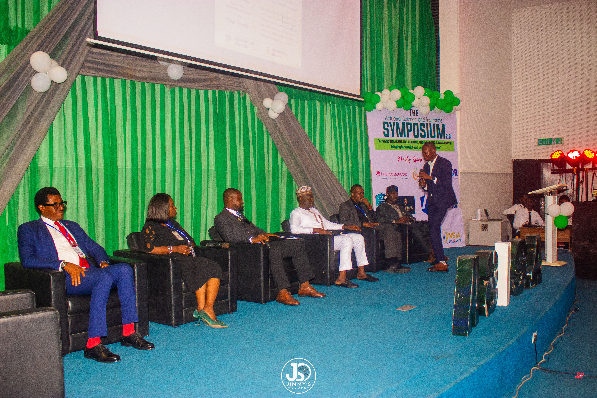
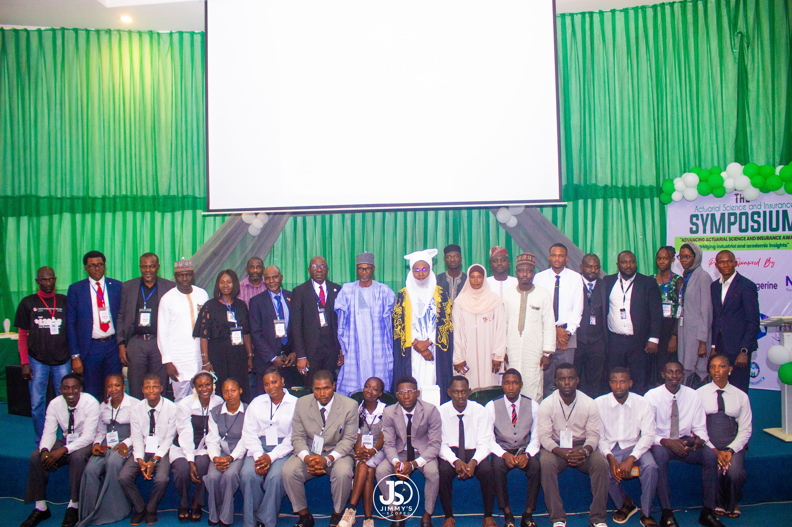
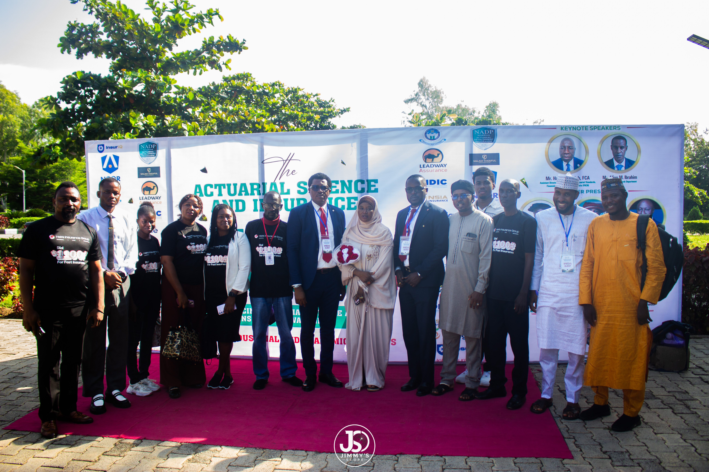

## Chapter 4: Primary Research Plan and Stakeholder Strategy

### 4.1 Target Population

The target population comprises decision-makers, policymakers, technical architects and operational leaders in the Nigerian insurance and financial-regulatory ecosystem, together with representatives of prospective beneficiaries. The study is not concerned with general public opinion. It targets individuals whose decisions directly affect the viability of blockchain-enabled insurance products.

### 4.2 Sampling Strategy and Sample Composition

The study employs purposive sampling (Patton, 2015; Palinkas et al., 2015), stratified across five respondent strata. Empirical work on thematic saturation suggests that core themes in relatively homogeneous groups tend to emerge within about a dozen interviews (Guest et al., 2006). This informs the floor of 11 core interviews, while the wider target accommodates the heterogeneity across strata and use cases.

| Component | Stratum | Minimum | Target |
|---|---|---|---|
| **Core** | Regulators and government entities | 2 | 2 to 3 |
| | Tier-1 underwriters | 4 | 4 to 5 |
| | Insurtech operators and Takaful | 3 | 3 to 4 |
| | Professional bodies and industry associations | 2 | 2 to 3 |
| **Core subtotal** | | **11** | **11 to 15** |
| **Extended** | Brokers | 1 | 2 |
| | Payments, off-ramp and stablecoin providers | 1 | 2 |
| | Agricultural and identity institutions | 2 | 2 to 3 |
| | Cardano ecosystem actors (weighted separately) | 1 | 1 to 2 |
| **Extended subtotal** | | **5** | **7 to 9** |
| **Expert calls** | Former regulators, sector experts | 5 | 5 to 8 |
| **Beneficiary-side** | Cooperatives, community and identity-access organisations (at least one northern and one southern group) | 2 | 2 to 3 |
| **Total** | | **23** | **25 to 35** |

A Minimum Viable Evidence Base of 11 core interviews must be reached before Milestone 3 can be declared substantially complete. The absolute floor of 23 applies only where a stratum is documented as inaccessible, in which case the shortfall and its effect on confidence are disclosed (Bias Control 6).

### 4.3 The Stakeholder Access Roster

Access to the following institutions was opened through the ASISA ABU network and consolidated at The Actuarial and Insurance Symposium 2.0 (26 August 2026; Chapter 7).

> [!IMPORTANT]
> **"Warm" access is not a confirmed interview.** Warm access means direct or institutional contact exists and the counterparty has orally expressed willingness to engage. No written commitment exists and no interview has yet been conducted. Every counterparty passes through the same consent and screening process regardless of how warm the relationship is (§4.4).

#### Archetype A: Regulators and government entities (the gatekeepers)

| Organisation | Role in the entry play | Access | Basis |
|---|---|---|---|
| NAICOM | Primary regulator and gatekeeper | Warm | Institutional route and symposium contact (Project Lead reported) |
| NDIC | Deposit insurance and stability oversight | Warm | Senior Research Department official listed as Guest of Honour |
| FRCN | Financial-reporting and actuarial standards | Warm | Senior official, Directorate of Actuarial Standards, listed as Guest of Honour |

#### Archetype B: Tier-1 underwriters and Takaful operators (the risk-bearers)

| Organisation | Role in the entry play | Access | Basis |
|---|---|---|---|
| Leadway Assurance | Product owner; potential pilot host | Warm | Sponsor branding; Chief Panelist; existing relationship |
| Heirs Insurance | Product owner; institutional scale | Warm | Sponsor branding; branded staff attendance; recipient of ASISA ABU's Institutional Award of Excellence |
| Tangerine Insurance | Digital-first insurer | Warm | Sponsor branding |
| NSIA Insurance | Tier-1 conventional underwriter | Warm | Sponsor branding; Branch Head participated as panelist |
| Salam Takaful | Takaful and agricultural Takaful | Warm | Sponsor branding; Takaful product literature distributed to attendees (Figure 7.8) |
| Noor Takaful | Takaful | Warm | Sponsor branding |
| Nem Insurance | Conventional underwriter | Open communications | Scheduling in progress |
| Linkage Assurance | Conventional underwriter | Open communications | Scheduling in progress |

#### Archetype C: Insurtechs and professional bodies (the innovators and standard-setters)

| Organisation | Role in the entry play | Access | Basis |
|---|---|---|---|
| InsureIQ (InsureAfrica) | Technical implementer; distribution platform | Warm | Sponsor branding |
| CIIN | Professional body; industry validation | Warm | Institutional mark on event materials |
| NAS | Actuarial standards and risk modelling | Warm | Project Lead reported |
| NADP | Actuarial capacity development; normative legitimacy | Warm | Institutional mark on event materials |

**Supplementary access.** ASISA ABU alumni are embedded in additional insurance organisations and provide referral channels for snowball sampling. Academic contributors to the Symposium programme form a candidate pool for Phase 5 methodological peer review. Archetype D (extended ecosystem and beneficiary-side organisations) is mapped in Phase 2.

### 4.4 Access Status Definitions

| Status | Definition |
|---|---|
| **Warm** | Direct or institutional contact established; oral expression of willingness to engage; no written commitment; no interview conducted. |
| **Open communications** | Correspondence under way; scheduling not agreed. |
| **Confirmed** | Interview scheduled, consent obtained and screener criteria (Appendix B) met. Assigned only in Phase 4. |
| **Desk-identified** | Identified through desk research; no contact made. |

Oral expressions of partnership are therefore treated as access, not as evidence of demand (Bias Control 9).

### 4.5 Interview Format and Logistics

- **Duration:** 45 to 60 minutes.
- **Mode:** virtual (Microsoft Teams or Zoom) or in person where advantageous.
- **Language:** English as primary; Hausa, Yoruba, Igbo and Nigerian Pidgin available for beneficiary-side engagement.
- **Recording:** audio-recorded with explicit consent and transcribed for thematic analysis.
- **Geographic coverage:** at least one northern location (anchored by Zaria and Kaduna) and one southern commercial location (Lagos).

### 4.6 Recruitment Sequencing

| Wave | Population | Approach | Timing |
|---|---|---|---|
| 1 | Symposium-engaged counterparties (Archetypes A to C) | Written invitation, information sheet and consent form | Outreach begins on approval of this submission; interviews from Week 8 |
| 2 | Open-communications underwriters | Standard outreach and screener | Weeks 6 to 10 |
| 3 | Extended stakeholders and expert calls | Ecosystem map and referrals | Weeks 8 to 13 |
| 4 | Alumni-referred contacts (snowball) | Referral with screener check | Weeks 9 to 14 |
| 5 | Beneficiary-side groups | Cooperative and community routes; local-language guide | Weeks 10 to 15 |

### 4.7 The Symposium as Recruitment Infrastructure

Rather than depend on low-conversion cold outreach, the Project Lead used The Actuarial and Insurance Symposium 2.0 to bring senior industry, regulatory and academic figures into direct contact with the research team. The photographic record below documents the multi-stakeholder composition of the event. Chapter 7 sets out its epistemic status and limits.

**Figure 4.1:** Moderated industry panel session at The Actuarial and Insurance Symposium 2.0 (26 August 2026), with panellists drawn from the underwriting and Takaful segments addressing an audience of students, academics and practitioners. Panel content is recorded as event-based observation and is not treated as adoption evidence (Bias Control 5). *Photograph: Jimmy's Scope.*

**Figure 4.2:** Group photograph of invited executives, guests of honour, ASISA ABU officers, staff and student volunteers, documenting the cross-sector composition of the Symposium (regulatory, underwriting, Takaful, insurtech, professional-body and academic participants). *Photograph: Jimmy's Scope.*

**Figure 4.3:** Red-carpet reception of special guests, staff of one of our sponsoring insurers (Heirs Insurance Group), ASISA ABU officers (President and Industry & Partnership lead) and volunteers before the event backdrop listing keynote speakers and partner institutions. This setting supported the in-person introductions on which the recruitment plan rests. *Photograph: Jimmy's Scope.*

### 4.8 Public Record of Ecosystem Outreach

ASISA ABU maintains public accounts of the Symposium and of its industry partnerships. They are cited as public reference points for stakeholder engagement, and are not offered as research evidence in themselves:

- [ASISA ABU on LinkedIn](https://linkedin.com/company/asisaabu): industry partnerships and sponsors.
- [ASISA ABU Instagram post on the Symposium](https://www.instagram.com/p/DcVlEhjo_l3/).
