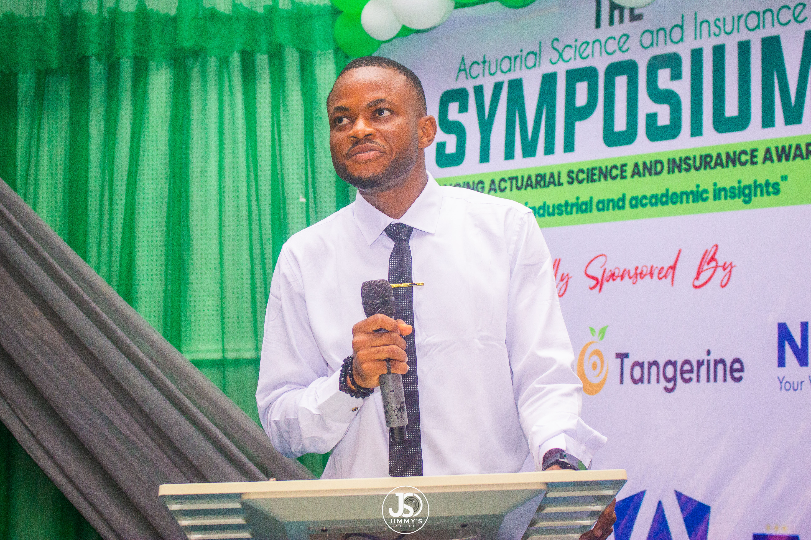
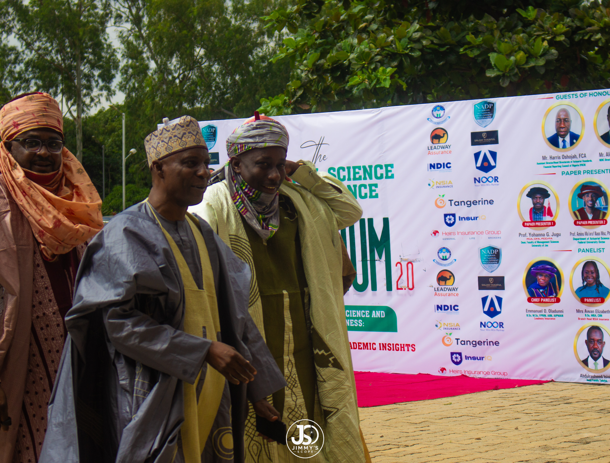
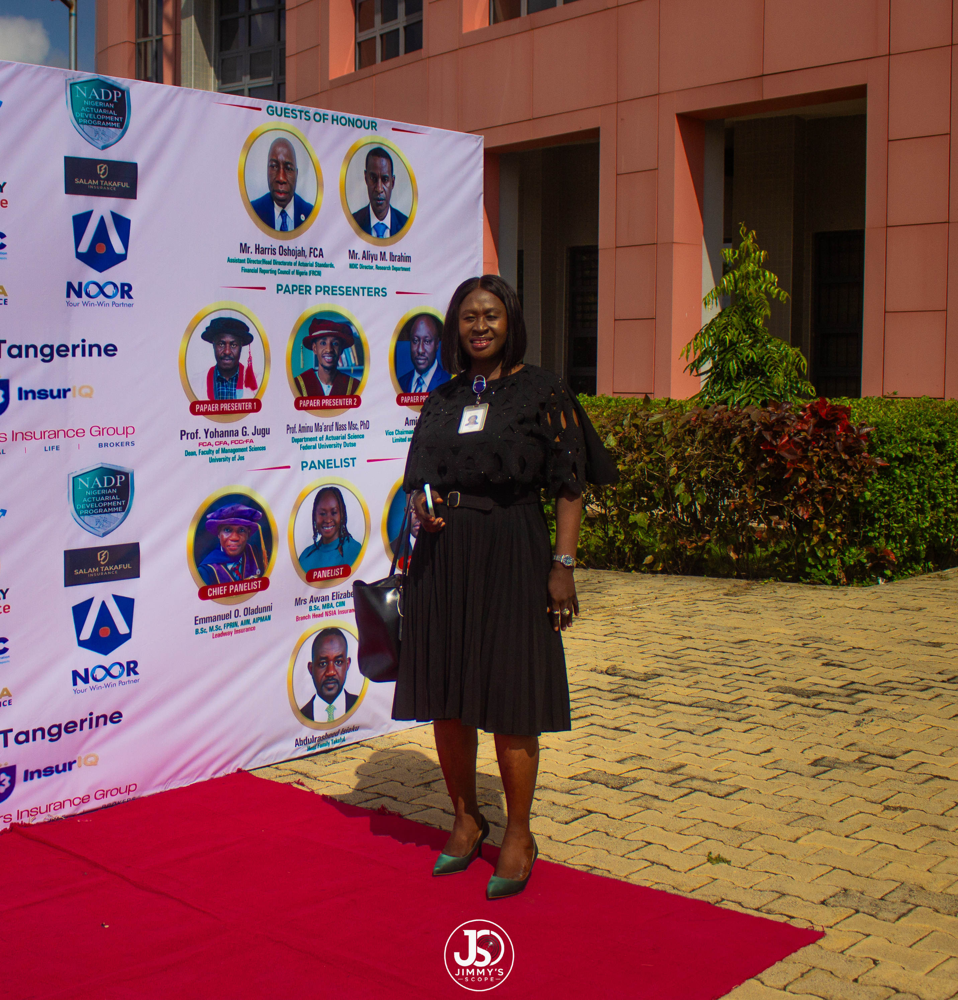
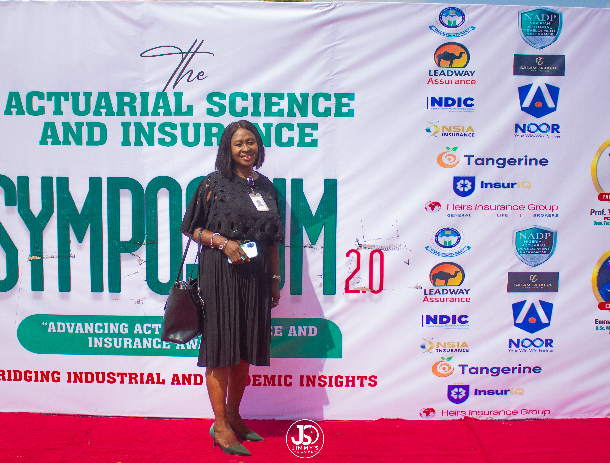
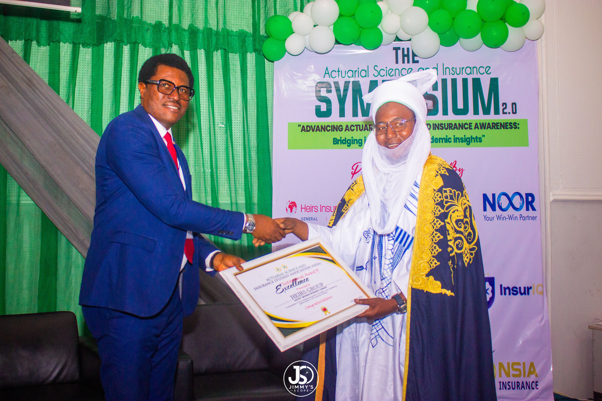
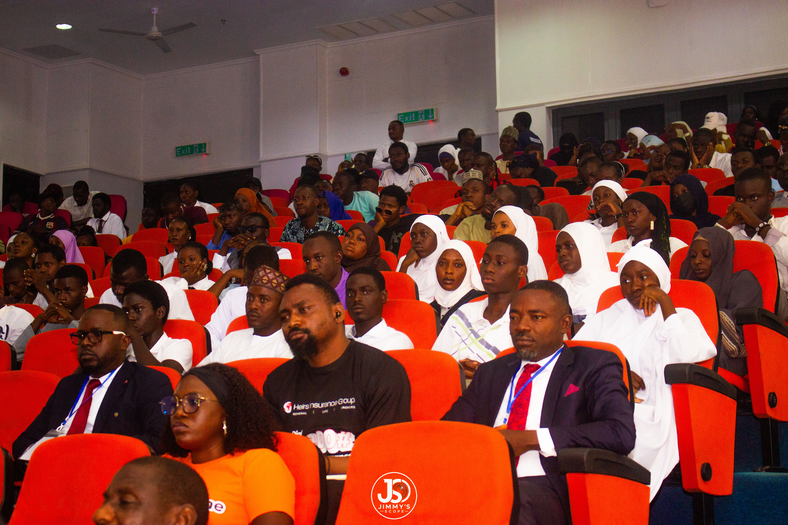
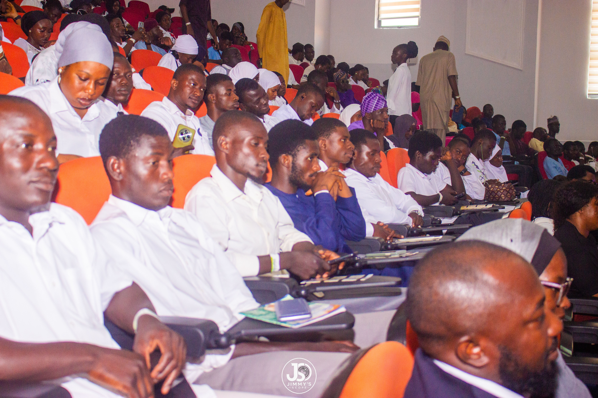
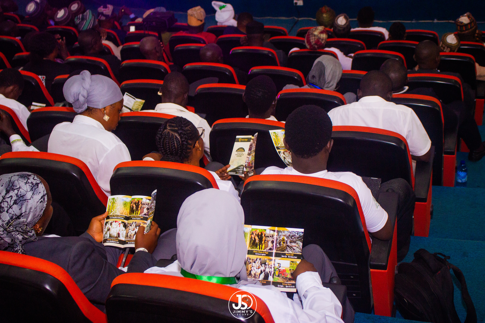
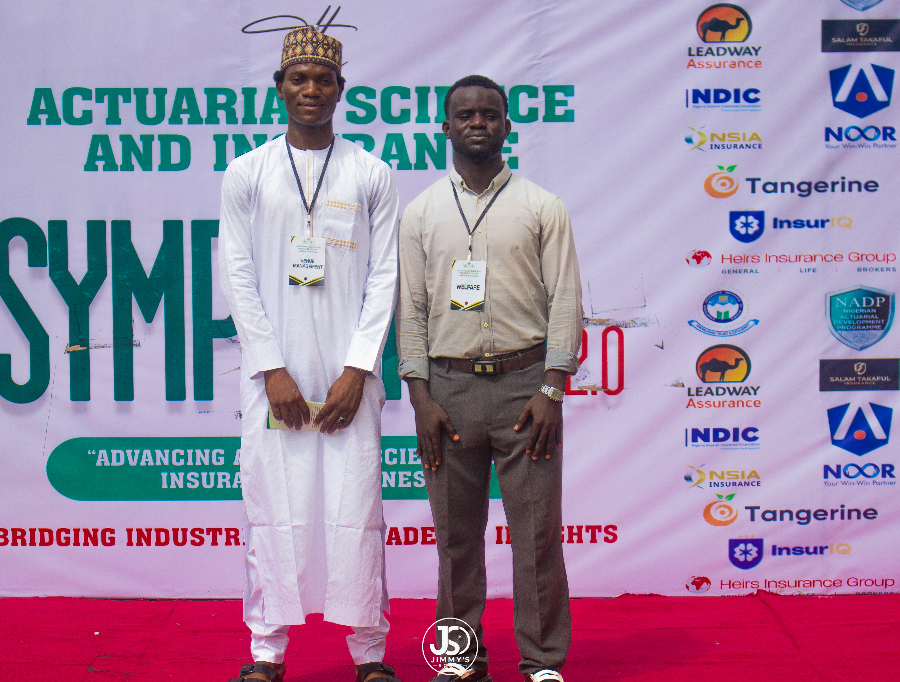

## Chapter 7: The Catalyst Event: The Actuarial and Insurance Symposium 2.0

### 7.1 Overview

The Actuarial and Insurance Symposium 2.0 was hosted by ASISA ABU on Wednesday, 26 August 2026 under the theme "Advancing Actuarial Science and Insurance Awareness: Bridging Industrial and Academic Insights." It brought together senior practitioners, regulators, academics and students from across the Nigerian insurance ecosystem. It was not a blockchain-specific event. This matters for the research design: because the forum was not built around the technology under study, the access it produced is less exposed to pro-blockchain selection than a technology conference would be.

### 7.2 Connection to ASISA ABU's Institutional Mission

ASISA ABU is the student association of the Department of Actuarial Science and Insurance at Ahmadu Bello University. The Symposium was planned independently of the research grant as part of the association's mission to advance awareness of actuarial science and insurance and to connect academic training with industry practice, which is the purpose stated in the event's theme. The research project benefits from that mission-driven platform, but did not create it. The distinction matters for the study's credibility: the event's programme, sponsors and audience reflect ASISA ABU's standing relationships and were not assembled to generate favourable research evidence.

### 7.3 Programme and Participation

| Programme role | Institutional representation (as printed on programme materials) |
|---|---|
| **Guests of Honour** | Financial Reporting Council of Nigeria (Directorate of Actuarial Standards); Nigeria Deposit Insurance Corporation (Research Department) |
| **Paper presenters** | Academic presenters from the University of Jos (Faculty of Management Sciences) and Federal University Dutse (Department of Actuarial Science), with further paper presenters listed |
| **Chief Panelist** | Leadway |
| **Panelists** | NSIA Insurance (Branch Head); Takaful segment (Head, Family Takaful); Heirs Insurance group (Regional Manager), Tangerine General (Group Head Retail Sales, SME & Partnership), further industry panelists |
| **Sponsor and partner branding** | Heirs Insurance Group; Leadway Assurance; NSIA Insurance; Tangerine; InsureIQ; Salam Takaful; Noor Takaful; NDIC; CIIN; NADP. |

The programme combined four formats: Keynotes speech, academic paper presentations drawing on management sciences and actuarial science, a moderated industry panel bringing underwriting, Takaful and professional perspectives to the event theme, and guest-of-honour addresses from regulatory and standards-setting institutions. The event closed with a vote of thanks and closing remarks by the ASISA ABU President (Figure 7.1) and included an institutional recognition segment (Figure 7.5). The panel discussion addressed themes including the state of insurance awareness in northern Nigeria, career pathways in actuarial science, the role of technology in insurance distribution and the challenges of scaling Takaful products. These themes, while not blockchain-specific, inform the contextual understanding behind RQ1 (operational friction) and RQ5 (demand-side acceptance). The photographic record shows a well-attended lecture-theatre plenary of students, academics and industry delegates (Figures 7.6 and 7.7). Individual names are omitted from this public document and may be added with each participant's consent.

### 7.4 Scale and Reach

The Symposium combined an in-person audience of students, academics and practitioners with a public digital record maintained by ASISA ABU on LinkedIn and Instagram (§7.7). The team does not publish an attendance figure that it cannot evidence from its own registration record. Reach is therefore described by composition: participants spanned regulators, underwriters, Takaful operators, insurtechs, professional bodies, universities and student members of the association, and eleven distinct institutional marks appear on the event backdrop (Figure 7.4). No independent press coverage has been relied upon in this submission.

### 7.5 Epistemic Status of the Event

> [!IMPORTANT]
> **What the Symposium is, and is not**
>
> The Symposium is used in this study in one way only: as a mechanism for access and structured observation. It is not evidence of demand for blockchain-based products, a statement of regulatory position by any attending regulator, a commitment by any organisation to a pilot or partnership, or an independent sample of the industry.

| The Symposium is | The Symposium is not |
|---|---|
| A source of warm, in-person introductions to tier-one counterparties | Evidence of demand for blockchain-based insurance |
| A venue for structured observation of sector priorities and attitudes | A regulatory position statement |
| A basis for consented follow-up interviews | A written or oral commitment to a pilot, partnership or purchase |
| A record of institutional engagement with ASISA ABU's network | An independent, representative sample (attendance is self-selected and sponsor-influenced) |

### 7.6 Evidence of Engagement by Counterparty

| Counterparty | Documented engagement | Recorded in |
|---|---|---|
| FRCN | Senior official listed as Guest of Honour | Figures 7.2, 7.3 |
| NDIC | Senior official listed as Guest of Honour; institutional branding | Figures 7.2, 7.3, 7.4 |
| Leadway Assurance | Sponsor branding; Chief Panelist | Figures 4.1, 7.4 |
| Heirs Insurance Group | Sponsor branding; branded staff attendance; Institutional Award of Excellence recipient | Figures 4.3, 7.5, 7.6 |
| NSIA Insurance | Sponsor branding; panelist | Figures 4.1, 7.4 |
| Tangerine, Noor Takaful, InsureIQ | Sponsor branding | Figure 7.4 |
| Salam Takaful | Sponsor branding; Takaful product literature distributed to attendees | Figures 7.4, 7.8 |
| CIIN, NADP | Institutional marks on event materials | Figure 7.4 |
| NAICOM, NAS | Access reported by the Project Lead through institutional routes and event contact; corroborated through the contact and access log (§7.8) | §4.3 |

### 7.7 Photographic Record and Public Channels

**Figure 7.1:** The ASISA ABU President and Project Lead, Odufuwa O. Oluwakayode, delivering the vote of thanks and closing remarks, acknowledging guests of honour, sponsors, speakers and participants. *Photograph: Jimmy's Scope.*

**Figure 7.2:** Arrival of guests of honour and senior invitees at the venue, in front of the programme backdrop listing guests of honour, paper presenters and panelists. *Photograph: Jimmy's Scope.*

**Figure 7.3:** An industry guest at the red-carpet station beside the programme backdrop identifying guests of honour, paper presenters and panelists. *Photograph: Jimmy's Scope.*

**Figure 7.4:** An industry guest before the main event backdrop showing the Symposium title and the marks of partner institutions (CIIN, NADP, Leadway Assurance, NDIC, NSIA Insurance, Tangerine, InsureIQ, Heirs Insurance Group, Salam Takaful and Noor Takaful). *Photograph: Jimmy's Scope.*

**Figure 7.5:** Presentation of ASISA ABU's Institutional Award of Excellence to Heirs Group. The recognition is disclosed under §6.4, and recipients are treated as sponsor-affiliated respondents. *Photograph: Jimmy's Scope.*

**Figure 7.6:** Attendees in the lecture theatre, including students, academics and industry delegates, during the formal proceedings. *Photograph: Jimmy's Scope.*

**Figure 7.7:** Wider view of the audience during the plenary session, showing the participation of student members and professional delegates. *Photograph: Jimmy's Scope.*

**Figure 7.8:** Attendees reading agricultural Takaful insurance cover literature that carries headings in several Nigerian languages, illustrating live industry engagement with products relevant to use case 1 and to the multilingual requirement of Bias Control 4. *Photograph: Jimmy's Scope.*

**Figure 7.9:** ASISA ABU organising-committee members serving in the Venue Management and Welfare roles at the red-carpet backdrop, representing the student-led operational capacity that delivered the event. *Photograph: Jimmy's Scope.*

**Public channels.** ASISA ABU's own channels carry timestamped accounts of the Symposium and of its industry partners and sponsors: [LinkedIn](https://linkedin.com/company/asisaabu) and [Instagram](https://www.instagram.com/p/DcVlEhjo_l3/). They are cited as public proof of the ecosystem outreach and stakeholder engagement behind the access roster, and are not used as inputs to any screening criterion.

### 7.8 Converting Symposium Contacts into Research Evidence

No Symposium contact becomes a respondent by default. The conversion protocol is:

1. **Contact log.** Event contacts and expressions of interest are consolidated into a log held in encrypted storage. It is the source register for every symposium-derived access claim and is available to the CPC on request.
2. **Written invitation.** Each counterparty receives a written invitation with an information sheet naming the funder, the purpose and the attribution options.
3. **Screening.** Respondents must meet the archetype criteria in Appendix B.
4. **Tagging.** All evidence originating from Symposium contact is tagged "symposium-sourced" and independently corroborated before it influences a score.
5. **No aggregation of goodwill.** Warmth of access is scored only under Criterion 6, against the definitions in §4.4.

### 7.9 Structured Observation Protocol

The team's observation of the event is organised around six items so that impressions can be compared across events and respondents: (1) problems named by practitioners without prompting; (2) attitudes toward technology adoption in general and toward distributed ledgers in particular; (3) regulator and standards-body statements about reform priorities; (4) Takaful and agricultural product concerns; (5) language and access issues; and (6) unprompted references to trust, claims settlement or fraud. Observations are recorded as event notes, tagged "symposium-sourced" and treated as hypotheses to be tested in Phase 4.

### 7.10 Limitations

- Attendance was self-selected and shaped by sponsor and institutional networks, so the roster over-represents organisations already inclined to engage with ASISA ABU.
- A northern, student-hosted event may under-represent Lagos-centred market participants. The southern-location requirement of §4.5 addresses this.
- Panel and plenary content was not designed as data collection.
- Participation by a public-sector official at a one-day event is not institutional endorsement. Bias Control 6 applies where direct interviews prove infeasible.
